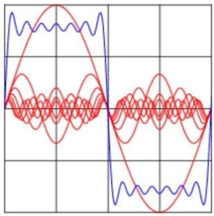
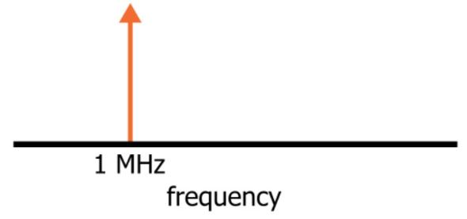
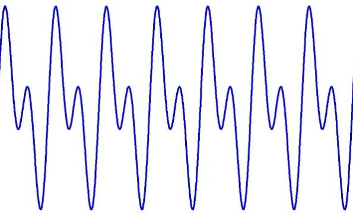
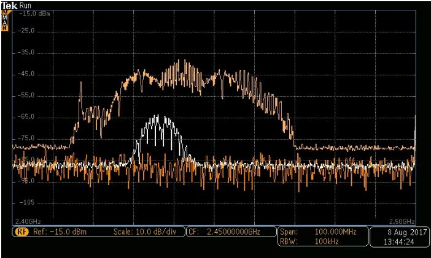

# 学习频率

------

## 第一章 射频原理和组件

什么是频域？为什么它对射频设计，分析和测试如此有价值？

熟练掌握射频设计过程中最基本的步骤之一就是学会在频域中进行思考。对于我们大多数人来说，我们在电路和信号方面的早期经验绝大部分都处于电压和电流的内容，以及电压或电流可以是静态的也可以是动态的。例如，当用万用表测量电池电压时，我们有一个静态量，而当在示波器上查看正弦电压时，我们有一个时变量。

射频可以概括为一个频率的世界，因为在时间范围内，设计和分析射频系统不是一个方便的事情。我们需要一种替代的方法，而傅立叶变换正是实现这种方法的数学路径，因为它提供了一种精确方法，即根据信号的频率内容描述该信号本身。

*此图显示了方波（蓝色）中的某些频率成分（红色）。*

在射频中，傅立叶变换可以处理极其复杂的信号变化，并将其转换为频域分量，该分量比原始时域波形提供的信息要丰富得多。

计算傅立叶变换或离散傅立叶变换（DFT）涉及的内容很具体；然而，不用担心，即使您对基本的数学理论了解甚少，也可以理解和采用频域技术。

傅立叶变换产生了信号的频率内容，而离散傅立叶变换（DFT）生成相应的数值数据。在实际工程中，图形表示通常更为方便，因为这些频域图变得像示波器迹线一样正常和直观。

### 频谱

频域图称为频谱。 1 MHz正弦波的理想频谱如下：

垂直箭头表示在1 MHz所生成的“能量”。箭头的线条部分非常细，因为此理想化信号完全没有其他频率分量-所有能量都恰好集中在1 MHz处。

如果我们通过电子电路将的1 MHz完美正弦波与的2 MHz完美正弦波求和，频谱将如下所示：

该频域图提供了有关我们求和后新信号非常清晰频率特征。如果您主要对电路的非瞬时频率相关行为感兴趣，则频谱可为您提供所需的信息。相反，时域波形显示就不这么明显了：

该轨迹是将一个频率为f的正弦量与第二个频率为2f的正弦量相加的结果，但这不够明显能够判断。

### 理想与现实
上面显示的细垂直箭头频率分量是数学构造的；真实的测量看起来像这样：

为什么会有差异？首先，测量系统的分辨率受到限制，并且这种限制会固有地损害原始信号中可能存在的任何“理想”质量。但是，即使我们拥有无限精确的测量设备，由于噪声的影响，频谱也会与数学构造版本有所不同。

可以产生上一部分所示的“纯”频谱分量的唯一信号类型是完美的正弦曲线，即没有噪声，周期或幅度也没有变化。然而与理想正弦波特性的任何偏差都会引入额外的频率分量。

一个直观的例子是相位噪声：期望现实世界中的振荡器总是产生完全相同的频率是不切实际的；实际周期不可避免地会有（希望很小）变化，这被称为相位噪声。如果您收集涵盖一千个周期的数据，然后执行频谱分析，则可以有效地对那一千个周期的频率内容求平均。结果将是上面显示的频谱形状。波形的宽度是前面计算得到的频率与标准频率的平均偏差。

### 频谱测量

频域图提供了一种非常方便的讨论和分析射频系统的方法。调制方式、干扰、谐波失真-甚至是在一张便条纸上绘制的基本频谱也可以帮助弄清情况。

但是，要成功设计射频系统，通常我们需要更复杂的东西。具体地说，我们需要一些能够为我们提供实际信号频谱特征的东西。这对于表征现有系统的功能是非常重要的，但是通常更迫切的需求是诊断和解决方案，即该设备为何不起作用以及我们如何对其进行修复。

数字示波器提供“ FFT”（快速傅立叶变换）功能，这是获得频谱测量值的一种方法。但是，用于实际频率分析的首选工具称为频谱分析仪。这是一台专门设计用于接受高频输入信号并显示该信号的频域表示的测试设备。掌握频谱分析仪的实践经验是熟悉射频工程实践方法的第一步。

### 总结

* 工程师可以通过时域或频域与电信号进行交互。在射频中，通常在频域中工作效率更高且更直观。

* 频域分析自然地抑制了在射频设计和测试中通常不重要的细节，同时强调了我们需要关注的特性。

* 频域图称为频谱。频谱可以方便地显示特征，例如调制方式或实际信号中由于干扰而引起的问题。

* 理论频谱通常由细的垂直箭头组成，这些箭头对应于理想化的固定频率的正弦曲线。

* 现实世界中的测量设备和现实世界中的射频信号总是存在缺陷，从而导致更宽的频域波形。

* 频谱分析仪是射频设计实验室必不可少的设备。这些设备提供频域图以及各种信号分析功能。