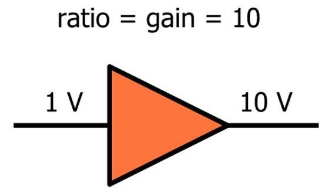
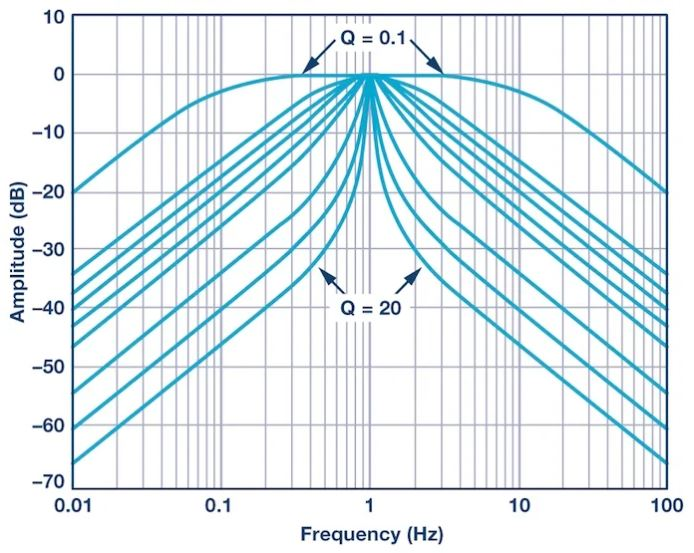
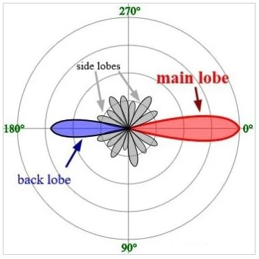

# 射频工程师分贝（decibel）指南

------

## 第一章 射频原理和组件

在射频设计和测试的背景下了解分贝及其变体。

像所有科学学科和子学科一样，射频工程涉及相当多的专业术语。在RF领域工作时，您需要使用的最重要的单词之一是“ dB”（及其某些变体）。如果您在RF项目中根深蒂固，则可能会发现“ dB”一词与您自己的名字一样熟悉。

您可能知道，dB代表分贝。它是一个对数单位，提供了一种方便的方式来引用比率，例如输入信号和输出信号的幅度之间的比率。

我们不会介绍分贝的一般细节，因为它们已经在AAC电路教科书的这一页上提供了。相反，我们将专注于射频系统特定环境中分贝的具体内容。

### 相对而非绝对

很容易忘记dB是相对单位。您不能说“输出功率为10 dB。” 电压是绝对的量度，因为我们总是说电位差，即两点之间的电位差;通常，我们指的是一个节点相对于0 V接地节点的电位。电流也是绝对测量，因为单位（安培）涉及特定时间量的特定电荷量。相反，dB是一个涉及两个数字之比的对数的单位。一个简单的例子是放大器增益：如果输入信号的功率为1 W，输出信号的功率为5 W，则比率为5：[Math Processing Error]。因此，该放大器提供了7 dB的功率增益-即，输出信号强度与输入信号强度之间的比率可以表示为7 dB。

### 为什么dB

在不使用dB的情况下设计和测试射频系统当然是可能的，但实际上dB随处可见。一个优点是dB刻度允许我们不用很大的数字就能表达非常大的比率：1,000,000的功率增益仅为60 dB。同样，信号链的总增益或损耗很容易在dB域中计算，因为只需将各个dB数字相加即可（而如果使用普通比率，则需要相乘）。

另一个优势是我们从使用过滤器的经验中得到的。射频系统围绕频率以及由组件和电路元件产生、控制或影响频率的各种方式进行。在这样的情况下，dB标度很方便，因为当频率轴使用对数标度，而幅度轴使用dB标度时，频率响应图既丰富又直观。

*波特图显示了不同带通滤波器的幅度响应。图片由AnalogDialogue提供。*

### 当dB为绝对值时

我们已经确定dB是一个比率，因此无法描述信号的绝对功率或幅度。但是，不断在dB和非dB值之间来回切换会很尴尬，这也许这就是射频工程师开发dBm单位的原因。

我们可以通过简单地创建一个始终包含参考值的新单位来避免“仅比率”问题。在dBm的情况下，参考值为1 mW。因此，如果我们有一个5 mW的信号，并且希望保持在dB的范围内，则可以将该信号描述为具有7 dBm的功率：[Math Processing Error]。

您一定要熟悉dBm的概念。这是现实生活中的射频系统开发中使用的标准单位，例如，在计算链路预算时，它非常方便，因为以dB表示的增益和损耗可以简单地与以dBm表示的输出功率相加或相减。 

还有一个dBW单位。它使用1 W作为参考值，而不是1 mW。如今，大多数射频工程师正在使用功率相对较低的系统，这也许可以解释为什么dBm更常见。

### 更多dB变体

另外两个基于dB的单位是dBc和dBi。

dBc使用载波信号的强度作为参考，而不是固定值（例如1 mW）。例如，相位噪声（在本章第2页中讨论）以dBc / Hz为单位报告；该单元的第一部分表示相对于载波功率正在测量特定频率下的相位噪声功率（在这种情况下，“载波”是指标准频率下的信号强度）。

理想的点源天线从发射器电路接收一定量的能量，并在所有方向上均等地辐射。这些“各向同性”天线被认为具有零增益和零损耗。

但是，可以将其他天线设计为将辐射能量集中在某些方向，从这个意义上说，天线可以具有“增益”。天线实际上并未在信号上增加功率，但会通过根据通信系统的方向集中电磁辐射来有效地增加发射功率（显然，当天线设计者知道发射器与接收器之间的空间关系时，这更为实用） 。

*图片来自蒂莫西·卡特尔（Timothy Truckle）[GFDL]。在这里，您可以看到辐射能量的不均匀分布，从而导致正向增益（即0°）。*

dBi单位允许天线制造商指定使用广受欢迎的dB刻度的“增益”数字。与往常一样，在使用dB时，我们需要一个比率；在dBi的情况下，天线增益是根据各向同性天线的增益给出的。

某些天线（例如带有抛物线形天线的天线）具有显着的增益，因此它们可以对射频系统的范围或性能做出不小的贡献。

### 总结

* dB标度是一种表示两个量之比的方法。它方便且广泛用于RF设计和测试环境中。

* 尽管dB数值本质上是相对的，但是绝对数量可以通过使用标有标准参考值的单位通过dB标度表示。

* 最常见的绝对dB单位是dBm。它传达的信号的dB功率约为1 mW。

* dBc单位表示相对于相关信号功率的功率。

* dBi单位表示相对于理想点源天线响应的天线增益。