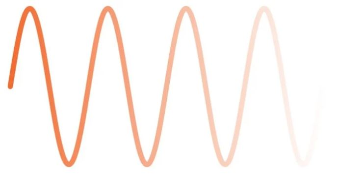

# 什么是射频，我们为什么使用它

------

## 第一章 射频原理和组件

了解电磁辐射知识，以及它在无线通信领域应用如此广泛的原因。

当我们想到电时，我们自然会想到电线。从高压传输线到电路板上的细微布线，电线是将电能从一个位置转移到另一个位置的基本方法。

但是历史一直在证明，人们很少，甚至永远不会对做事的基本方式感到满意，随着人类的努力，电的应用激增，电的功能也摆脱了物理互连的限制。

有多种方法可以将“无线”功能应用到电气系统中。其中一种方法是电磁辐射，这是射频通信的基础。然而我们需要知道，电磁辐射并不是将集成电路扩展应用到无线领域的唯一方式。任何可以通过非导电材料传播的东西（机械运动，声波，热量）都可以用作（也许是粗略的）将电能转换为信息的一种手段，这种手段不依赖于连接的导体。

*可处理的正弦电压（或电流）信号是现代无线电的基础*

考虑到这一点，我们可以问自己一些更相关的问题：为什么电磁辐射是首选方法？为什么其他类型的无线通信方式是次要的？在回答这些问题之前，我们需要了解什么是电磁辐射。

### 域和波

您可能需要花费数年的时间学习电磁学。幸运的是，在您基本了解设备天线发射原理后，即使没有专业知识也能成功设计和实现RF电路。

顾名思义，电磁辐射既涉及电场又涉及磁场。如果您有电压（例如，天线阻抗两端的电压），那么您将拥有电场（从数学的角度来看，电场与电压的空间变化率成正比）。如果您有电流（例如流经天线阻抗的电流），那么您将有一个磁场（磁场强度与电流的大小成正比）。

即使电压或电流的大小恒定，也会存在电场（electric fileds）和磁场(magnetic fields)。但是，场不会传播。如果我们想有一个波在宇宙中传播，我们需要改变电压和电流。

*电磁波的电和磁分量表示为垂直正弦曲线。*

这种传播现象的关键是电磁辐射的电和磁成分之间的自我维持关系。变化的电场产生磁场，而变化的磁场产生电场。这种相互再生表现为特有的实体，即电磁波。一旦产生，该波将以光速从其源头向外传播，日复一日地朝着未知的深处传播。

### 参数电磁辐射（EMR）与控制电磁辐射（EMR）

设计整个射频通信系统并不容易。然而，产生电磁辐射（EMR）非常容易，实际上，电磁辐射的产生并不是按计划要求的。任何电路中的任何时变信号都会产生EMR，其中包括数字信号。在大多数情况下，电磁辐射只是噪声，如果该电磁辐射没有造成任何麻烦，则可以忽略它。在某些情况下，它实际上可能会干扰其他电路，在这种情况下，它会变成EMI（电磁干扰）。

因此，我们看到，射频设计不仅仅是产生电磁辐射。确切地说，射频设计是一种生成、处理和解释电磁辐射的艺术和科学，它使您能够在没有直接电器连接的两个电路之间可靠地传输有意义的信息。

### 电磁辐射？

现在让我们回到一个问题，即为什么与其他形式的无线通信相比，基于电磁辐射的系统如此普遍。换句话说，为什么“无线”就是指射频，即使存在其他各种无需借助导线传输信息的情况？这里主要有几个原因：

* 敏捷

电磁辐射是有线电路中使用的电信号的自然扩展，时变电压和电流都会产生电磁辐射，此外，电磁辐射是原始信号交流部分的精确表示。

*复杂的QPSK波形的每个部分都传输两位数字信息。*

让我们考虑一个极端的（完全不切实际的）反例：基于热量的无线通信系统。想象一个房间包含两个单独的设备，发射器设备根据要发送的消息将房间加热到特定温度，接收器设备测量并解释环境温度。这是一种缓慢，笨拙的系统，因为房间的温度无法精确地跟踪复杂电信号的变化。另一方面，电磁辐射具有高度响应能力，发射器设备发射的射频信号可以真实地重新生成复杂的高频波形。

* 速度

在交流耦合系统中，数据的传输速率取决于信号变化的速度。换句话说，信号必须做某些事情（例如幅度增加和减少），以传达信息。事实证明，即使在非常高的频率下，电磁辐射仍是一种实用的通信介质，这意味着射频系统可以实现高频的数据传输。

* 范围
无线通信的目标是实现长距离通信；如果发射器和接收器非常接近，那么使用导线通常更简单且更节约成。尽管射频信号的强度根据平方反比下降，但是电磁辐射（结合调制技术和复杂的接收器电路）在远距离传输后的信号使用仍旧出色。

*随着发射能量在所有方向上向外传播，电磁辐射的强度呈指数下降。*

* 不可见

光是唯一可以与电磁辐射竞争的无线通信介质。这并不奇怪，因为光实际上是非常高频的电磁辐射，但射频通信的优势是不可见。

我们的物理世界充满了阻挡光线（甚至是非常强大的光）的固体物体。我们所有人都经历过盛夏烈日的照耀，但仅用一块薄布便可以减弱光照强度。相比之下，射频系统通过低频电磁辐射就能穿过墙壁、塑料外壳、云层，更神奇的是，它能穿过人体的每个细胞。 射频信号可能会受这些材料的影响，在某些情况下，可能会发生明显的衰减。但是与光相比，（低频）电磁辐射几乎可以在任何地方使用。

### 总结

*  “ 射频”是指使用电磁辐射在没有直接电线连接的两个电路之间传输信息。

* 随时间变化的电压和电流会产生电磁能，并以波的形式传播。我们可以通过使用和处理这些波来传输模拟和数字数据。

* 电磁辐射是无线通信的主要形式,一种替代方法是使用光通信（例如在光纤中），但是射频通信用途更多，因为低频电磁辐射不会被不透明的物体阻挡。