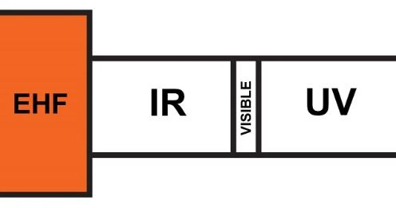

# 射频通信的频率

------

## 第二章 电磁频谱

电磁频谱只有一个，但是通过使用不同的载波频率，许多RF设备可以共存。射频世界就是频率世界。考虑到一个RF设计可能涉及多个频率范围的信号，在单个系统甚至单个PCB中都是如此。在这一点上，我们需要广泛研究特定的RF系统。该研究领域的概念是“电磁频谱”，更具体地说，我们将讨论常用于RF通信的电磁频谱。光包含在电磁频谱中，超低频无线电波也包含在电磁波谱中，而工程设计系统中的使用受到限制。光是一种传输信息的有用手段，但其行为与中频电磁辐射（EMR）截然不同，因此我们将其归为一类，即光通信而非无线通信。低频电磁辐射（EMR）具有特殊用途，并且在世界范围内都由电网不断产生，但它不是主流无线通信的一部分。

### 频率：Why & How

在讨论各种频率类别之前，让我们回顾两个基本问题：为什么我们使用这么多不同的频率？设计人员如何确定适合特定应用的频率？

* 干扰

在相同频率下工作的两个或多个发射机会产生干扰，它们使接收机设备很难将相关的RF信号与无关的RF信号分开。当使用不同的频率时，该问题在很大程度上消失了。一个频率的电磁辐射（EMR）不会“破坏”另一频率的电磁辐射（EMR），并且不相关的信号很容易通过滤波的方式消除掉。

*频率之间的适当间隔的干扰信号可忽略。*

当然，干扰不会消失，因为两个信号之间相隔了几分之一赫兹-频率，然而间隔越大，干扰就越少。尽管如此，将不同的频率用于不同类型的RF通信还是非常有效的：在世界各地，每天都有许多无线系统同时运行，而功能没有任何重大损失。

* 选择一个评率

电磁辐射（EMR）的特性随频率而变化。例如，极低频的波可以有效地穿透水，因此在您需要与潜水艇通信时会很有帮助。举一个例子，某些频率使无线电信号能够传播很长的距离，因为这些频率会经历大气折射，特定RF系统的场景目标会严重影响选择工作频率范围的过程。

*电离层折射可实现远程通信。*

上一段提到了频率影响传播特性的示例。但是，通常，更重要的考虑因素是带宽（在模拟系统中）或数据速率（在数字系统中）。

如果要无线传输频率分量高达10 kHz的音频信号，则不能使用5 kHz发射机（即载波）频率。频率与信号传输信息的速率相对应，因此您不能将10 kHz的音频信息“适配”到5 kHz的载波中。此外，出于实际考虑，要求载波频率明显高于信息（即基带）频率。因此，宽带和更高数据速率的系统必须占据电磁频谱的高频部分。

* 频率

无线电频频谱，即电磁频谱的无线电通信部分，从VLF（极低频）频带扩展到EHF（极高频）频带，即大约3 kHz至300 GHz。将VLF与EHF分开的其他频段是：

+ LF（低频）
+ MF（中频）
+ HF（高频）
+ VHF（甚高频）
+ UHF（超高频）
+ SHF（超高频）

这些划分是相当随意的，不需要知道确切的频率范围。最好简单地给出在频谱的不同部分中找到的一些无线通信类别的示例，因为这将帮助我们直观地了解哪些频率范围更适合某些类型的系统。

+ AM无线电通信使用MF频段；更具体地说，载波频率在540 kHz至1600 kHz之间变化。从经验中我们知道，调幅收音机具有良好的射程，并且可以抵抗建筑物的物理干扰，但是调幅收音机没有出色的音质。

+ FM无线电通信使用VHF频段，载波频率为88.1至108.1 MHz。在FM中，与载波的允许偏差比在AM中明显更高，这意味着FM信号每单位时间可以比AM信号传输更多的信息。 （请记住，在这种情况下，“ AM”和“ FM”是指无线电传输的标准化类别，而不是通常的幅度和频率调制。）

+ 诸如蓝牙和某些802.11协议之类的数字通信系统工作在低千兆赫兹范围内，更具体地说，工作在2.4 GHz附近。这些通常是短距离系统，但是它们提供可靠的通信，并且高载波频率可以实现高数据速率。这些协议可由很小的设备使用，但可提供较长的电池寿命。

+ 卫星（显然代表着重要的远程应用）倾向于以很高的频率运行。在此范围的较低端（1-2 GHz）是L波段，GPS卫星使用该波段。例如，卫星电视网络使用C波段（4–8 GHz）。 Ku频段扩展到令人印象深刻的18 GHz频率，被用于各种卫星应用，并且是国际空间站通信设备的重要组成部分。

* 从电磁辐射（EMR）到光

上述卫星频率大部分保持在无线电频谱的SHF部分内。EHF频带是无线电波和光波之间的过渡； EHF信号受到大气中的气体和湿气的严重阻碍，这使我们想起了光辐射及其无法穿透不透明物体的能力。频率高于EHF频段的信号被归类为红外辐射，而不是无线电波：

### 总结

* 电磁频谱是指宇宙中存在的电磁辐射（EMR）频率范围。该频谱被划分并细分为不同的频带。
* 与RF通信相关的一般部分被称为无线电频谱，并且无线电频谱被划分为八个频带。
* 通过使用不同的载波频率可以避免单独的无线电系统之间的干扰。
* 带宽和传播要求会影响载波频率的选择，进而载波频率会影响特定系统的特性。
* 无线电频谱内的最高频段的行为更像无线电波的信号到行光信号的过渡。