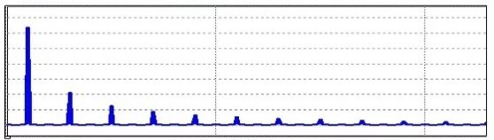
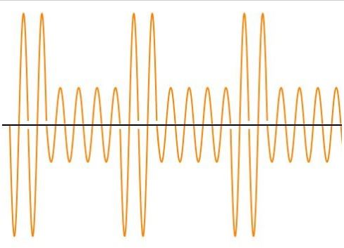
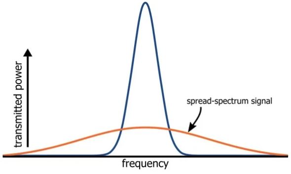

# 低功率射频设备和ISM频段

------

## 第二章 电磁频谱

该节主要了解数字调制怎样帮助提高低功率RF通信的可靠性，以及ISM band是什么。

从历史的角度考虑，射频系统与大功率传输密切相关。我们想象到用于AM和FM电台的大型天线，长距离军用收音机，甚至是奇异的应用，例如用于与航天器通信和控制航天器的系统。这些系统关联到一些模糊的想法，即距离越远越好，因此功率越大越好。

高功率射频绝非罕见的，但在许多方面，它与我们的日常生活越来越分离，或者至少可以说，它在我们的日常生活中不是显而易见的，因为我们现在的注意力集中在小型，低功耗的无线设备上。

*蓝牙产品是电池供电的无线设备，在现代生活中非常常见。*

在这样的系统中，设计工作致力于以最低的功耗实现可接受的性能。这意味着功耗可能比最大功率传输更为重要，也意味着可能不希望达到最大功耗范围，主要目的只是简单地获得足够的功耗范围，即允许设备用于其预期目的的功耗范围。

一个有趣的例子涉及助听器，人体的感觉系统设计成两只耳朵不足为奇，因为人脑通过结合这两种相关的感觉流（大概以相当复杂的方式）来完善我们的体验和对声音做出反应的能力。在两只耳朵中佩戴助听器可以帮助恢复对声音的平衡感知，但是现代设备通过与另一只耳朵中的助听器进行实际通信而更进一步，这样，两个助听器可以“一起工作”以微调其响应。

这是不需要最大化范围的RF系统的完美示例，设计人员几乎完全知道发射器和接收器之间将分开多少距离，并且现实的情况不会因为更长的距离而更加有利。

### 数字与模拟

低功率射频系统中的一项重要技术是数字调制，这并不是指实际发送数字（即矩形）信号，尽管这并非不可能，但由于矩形波具有高谐波含量，因此不切实际。所发射的信号在远离载波频率的频率处包含大量能量，因此它将成为干扰源。

*方波的频谱,可见谐波频率下能量过多。*

如前一节所述，电磁频谱必须保持有序组织，以确保许多无关的设备可以可靠地实现无线通信。这意味着必须将无线传输限制在特定的分配频率范围内，并且在使用矩形信号时这是不可能的。

### 数字调制

数字调制使用正弦波，就像模拟调制一样。不同之处在于，在数字系统中，载波的调制并不代表模拟基带信号的连续表示，而是代表数字数据。载波的变化发生在称为符号的离散部分中，每个符号代表一个或多个位。我们将在本教材的后面部分更深入地讨论。

*数字调制的示例-在这里为幅度调制。*

数字调制提供的好处类似于典型的数字通信的好处，由于信息是作为离散位而不是连续变化的信号进行传输的，因此可以在不损失数据的情况下将发送功率降至最低-只要功率足以使接收器能够区分0和1，即可接收所有数据将成功转移。而且，如果瞬态干扰引起信噪比的短暂降低，则数字通信允许接收器要求发送器重新发送数据的特定部分。

通常被称为数据链路的数字RF系统具有能够实时评估其自身性能优势，诸如循环冗余校验之类的错误检测算法可用于评估连接质量。如果接收设备发现比特错误的频率显着增加，则可以要求发送器增加其输出功率，这样就可以根据数据链路的实际性能优化发送器的功耗。

### ISM Bands

如前一节所述，任何想要运行RF发射器的组织都必须获得适当监管机构（例如美国的FCC）的明确许可，该规则最明显的例外是使用ISM频段。

ISM代表工业，科学和医学。据推测，这反映了FCC的初衷，但是名称不再相关。 ISM频段已被其他产品类别中的众多设备使用，这些产品包括蓝牙，Wi-Fi，家庭安全系统，射频识别（RFID），玩具，无绳电话等

### 未经许可和不受监管

ISM频段是无牌的，但重点是不受监管的。 “未经许可”是指未经监管机构明确许可而开发和销售ISM频段设备。 “不受管制”表示只要您保持在ISM频率之内，您就可以传输所需的任何内容，但事实并非如此。最直接的限制是发射功率：通常，传送到天线的功率不能超过1 W（30 dBm）。但是，当您深入了解诸如跳频或扩频传输之类的情况时，情况将变得更加复杂。

*扩频调制；这将在后面的章节中讨论。*

此外，对带外传输能量也有限制，这很重要，因为低阶谐波会导致大量的传输能量落在可接受的频率范围之外。尽管2.4 GHz实际上不是中心频率，但是最重要的ISM频段被称为2.4 GHz频段。频段从2.4扩展到2.4835 GHz。该频段的主要优势在于其在全球范围内的可用性-其他ISM频段因地区而异，但2.4 GHz频段可在全球范围内用于无牌运营。

### 总结

* 低功率射频设备在我们的日常生活中越来越普遍。除了对节约能源的普遍兴趣外，低功率运行还可以延长电池寿命。
* 在许多RF系统中，数字数据传输是一项重要技术。在低功率系统中，它可以更有效地利用电池电量。
* 数字调制是指使用模拟波形来传输数字数据。
* ISM频段是典型RF许可要求中的例外，许多无线设备使用ISM频率。
* ISM频段设备不需要许可证，但是必须遵守管理这些频段的法规。