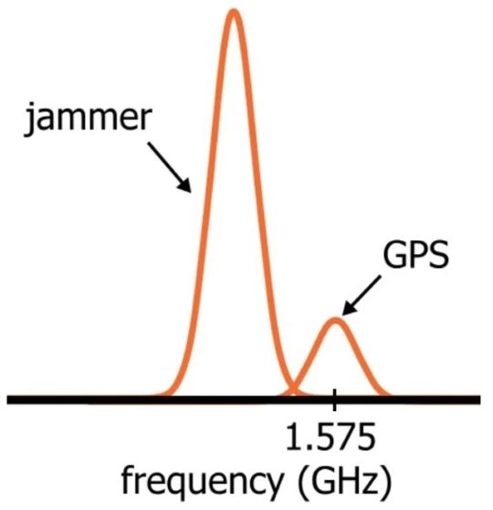
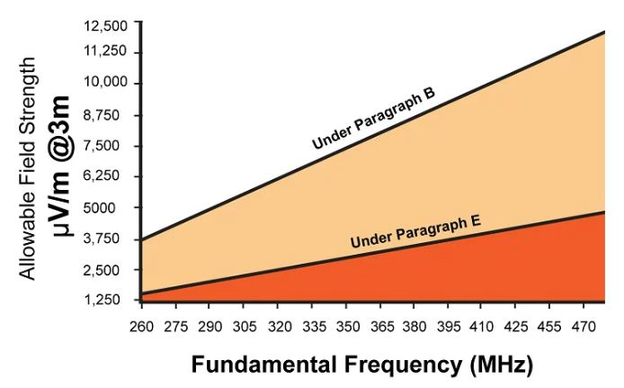
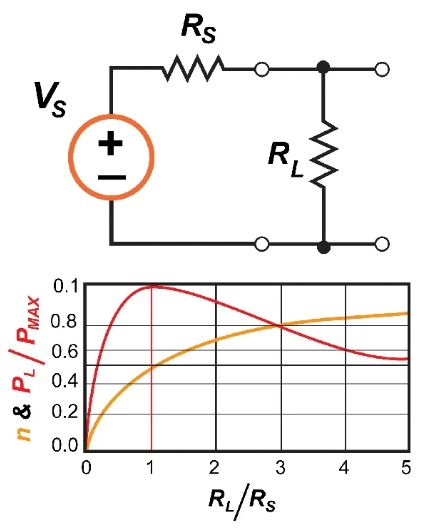

# 射频传输：规则，干扰和传输功率

------

## 第二章 电磁频谱

该节主要了解如何将最大功率从放大器传输到天线，以及如何使用示波器估算此功率。

RF技术的一个重要特征如下：一个人相对容易阻止甚至彻底破坏另一个人的无线通信。无线电波在空中传播，每个人都可以使用，包括那些有意或无意地发送干扰的信号的人。首先，必须了解您不能“破坏”或“损坏”已发射的无线电信号，这一点很重要。尽管如此，干扰的影响可能等同于破坏原始信号，因为它损害了接收机提取该信号中包含的重要信息的能力。换句话说，该信息仍然存在，但是对于特定的接收者，实际上已经不存在了。干扰是RF设计中的一个持续挑战，并且无线设备的普及并没有使这种情况变得更简单。使系统具有抗干扰性的方法有很多种，在稍后的内容中进行讨论。然而大多数这种干扰产生仅仅是由于非通信设备必须经常利用相似的载波频率。

但是，还是存在故意干扰的情况。目的是广播以一种或另一种方式阻止其他无线系统保持成功通信的信号。干扰是现代战争中的一项重要战术，在日常生活中是令人讨厌的事情（或更糟的情况），完全是非法的。

*该频谱描述了一个强信号干扰GPS设备的情况。*

### 规范

最初政府对无线监管充满犹豫，但是事实清楚地表明，缺乏法规将导致严重的问题，需要严格的组织以确保电磁辐射（EMR）领域不会恶化为混乱的干扰信号。在美国，维护无线通信领域秩序的任务落在了联邦通信委员会（FCC）的手中，想要利用电磁频谱一部分的私人和公共组织必须获得FCC的许可。对于范围有限的系统也有例外，因此不太可能造成重大干扰。

### 最大功率

如果您对（合法）免许可证无线电传输感兴趣，则需要了解您的传输功率。即使以有效范围或其他度量标准给出了官方规范，您也应该能够确定在这些情况下通常认为可以接受的发射功率，并且估计功率比尝试准确测量系统的范围或功率要容易得多。

*该图根据FCC的“第15部分”规则给出了针对特定频率范围的场强限制。*

在RF和所有其他类型的电路中，组件消耗的功率等于该组件两端的电压乘以流经该组件的电流。您可能会认为天线只是导体，因此电阻很小。的确，导体在直流下的电阻可能非常低，但是在较高频率下，天线的输入阻抗会很大。我们对天线在特定频率下用于传输RF信号的阻抗感兴趣；我们将需要此信息来估计传送到天线的功率。

### 电压传输与功率传输

在典型的数字或模拟电路中，我们不希望导线或PCB走线的电阻为50Ω。对于某种被形容为导体的东西来说，这似乎是极高的电阻。但是我们必须记住，在低频电路中，我们通常对电压传输很感兴趣，即我们要确保输入引脚上的电压尽可能接近前一个输出引脚上的电压。为了实现良好的电压传输，我们需要低输出阻抗，低导体阻抗和高输入阻抗。

但是，在RF发送器（或音频放大器）的输出阶段，目标是功率传输。我们不只是希望将电压从一台设备转移到另一台设备。我们希望大量电流流过天线，以便它具有足够的电能，可以将其转换为辐射的电磁能。当负载阻抗的幅度等于源阻抗的幅度时，会发生最大功率传输。

如您所见，当RL = RS时，负载功率（PL）最大。但是请注意，效率（η）继续增加到此点之外，最大功率传输不对应最大效率。

在射频电路中，放大器的输出级（以及将放大器连接到天线的传输线）通常具有50Ω的阻抗，因此天线阻抗也必须为50Ω，以确保最大的功率传输。 （这里的另一个重要主题是“匹配网络”，用于改善放大器和天线之间的阻抗匹配；这将在后面的文章中讨论。）

### 功率估计

前面的讨论解释了为什么我们可以通过将功率放大器连接到50Ω示波器输入来分析RF输出级：大多数RF系统都是围绕50Ω阻抗构建的，因此通常需要50Ω天线阻抗。当然，如果您知道电路的相关电压和阻抗特性，则只需计算传递到天线的功率即可。 SPICE仿真器将是另一种有效的方法。但是，如果对这些技术您不够熟悉，或者要进行经验验证，则需要使用测量设备。如果您有频谱分析仪，则一定要使用它。它可以输出此类信息。如果您没有频谱分析仪，则可以使用示波器。使用50Ω示波器输入查看信号的RMS电压，然后将功率计算为V2 / R，其中R = 50Ω。

### 总结

* 仔细调节电磁传输，以减轻与意外干扰相关的问题。在平民生活中，故意干扰（称为干扰）是非法的。
* 在美国，传输设备通常必须获得FCC的许可。
* 在与发射功率受限的某些条件下，可以免许可证运行。
* 为了实现从放大器到天线的最大功率传输，放大器的输出阻抗的大小必须与天线输入阻抗的大小匹配。
* 发射功率可以通过数学分析或SPICE仿真确定。也可以使用频谱分析仪或示波器凭经验进行估算。