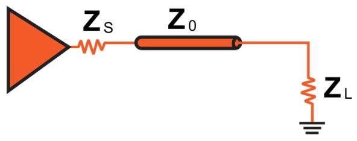
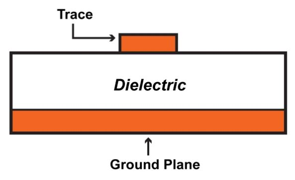
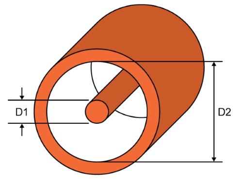
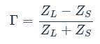
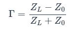
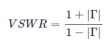
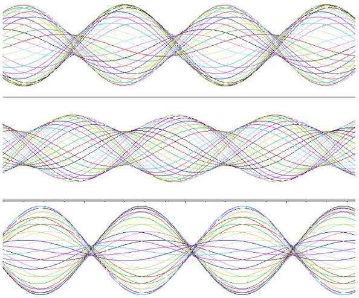

# 50Ω问题：RF设计中的阻抗匹配

------

## 第三章 现实生活中的射频信号

阻抗匹配是射频设计和测试的基本方面。阻抗不匹配引起的信号反射会导致严重的问题。当您处理由理想电源，传输线和负载组成的理论电路时，匹配似乎是一项微基础的练习。

假设负载阻抗是固定的，我们需要做的就是包括一个等于ZL的源阻抗（ZS），然后设计传输线，使其特性阻抗（Z0）也等于ZL。但是，让我们暂时考虑一下在由众多无源元件和集成电路组成的复杂RF电路中实施此方案的难度。如果工程师不得不根据选择的一个阻抗作为所有其他阻抗的基础来修改每个组件并指定每个微带的尺寸，则RF设计过程将非常笨拙。此外，这还假定该项目已经进入PCB阶段。如果我们要使用离散模块以现成的电缆作为互连来测试和表征系统，该怎么办？在这种情况下，补偿不匹配的阻抗更加不切实际。解决方案很简单：选择可在众多RF系统中使用的标准化阻抗，并确保相应设计组件和电缆。已经选择了该阻抗。单位是欧姆，数字是50。

### 50Ω

首先要了解的是，对于50Ω阻抗，本质上没有什么特别的。这并不是宇宙的基本常数，尽管您可能会觉得这个问题在RF工程师身上花费足够多的时间。它甚至不是电气工程的基本常数，请记住，简单地改变同轴电缆的物理尺寸会改变特性阻抗。

尽管如此，50Ω阻抗还是非常重要的，因为大多数RF系统都围绕该阻抗进行设计。很难确切地确定为什么50Ω成为标准的RF阻抗，可以合理地假设发现50Ω在早期同轴电缆的情况下是一个很好的折衷方案。

当然，重要的问题不是特定值的来源，而是具有此标准化阻抗的好处。实现完美匹配的设计要简单得多，因为IC，固定衰减器，天线等制造商可以在考虑阻抗的情况下构建其零件。而且，PCB布局变得更加简单，因为如此多的工程师都有相同的目标，即设计特征阻抗为50的微带和带状线。

*您可以按以下方式创建50Ω微带：1盎司铜，20 mil宽的走线，走线和接地层之间的间隔为10 mil（假设FR-4电介质）。*

在继续进行之前，请明确一下，并非每个高频系统或组件都设计为50Ω。可以选择其他值，实际上75Ω阻抗仍然很常见。同轴电缆的特性阻抗与外径（D2）与内径（D1）之比的自然对数成正比。

这意味着内部导体和外部导体之间的更大间隔对应于更高的阻抗。两个导体之间的较大间距也导致较低的电容。因此，75Ω同轴电缆的电容比50Ω同轴电缆的电容低，这使75Ω电缆更适合于高频数字信号，该信号需要低电容，以避免与之间的快速过渡相关的高频成分过度衰减。逻辑低和逻辑高。

### 反射系数

考虑到阻抗匹配在RF设计中的重要性，我们不难发现有一个用于表示匹配质量的特定参数。称为反射系数；符号是Γ（希腊大写字母gamma）。它是反射波的复振幅与入射波的复振幅之比。但是，入射波和反射波之间的关系由源（ZS）和负载（ZL）阻抗确定，因此可以根据这些阻抗定义反射系数：

如果在这种情况下，“源”是传输线，我们可以将ZS更改为Z0。

在典型的系统中，反射系数的大小为零到一之间的数字。让我们看一下数学上最直接的三种情况，以帮助我们了解反射系数与实际电路行为的对应关系：

如果匹配完美（ZL = Z0），则分子为零，因此反射系数为零。这是有道理的，因为完美匹配不会导致反射。如果负载阻抗是无限的（即开路），则反射系数变为无穷除以无穷大，即无穷大。反射系数为1对应于全反射，即所有波能都被反射。这是有道理的，因为连接到开路的传输线对应于完全不连续（请参见上一节）- 负载不能吸收任何能量，因此必须全部反射。
如果负载阻抗为零（即短路），则反射系数的大小变为Z0除以Z0。这样我们又有了|Γ| = 1，这是有道理的，因为短路也对应于不能吸收任何入射波能量的完全不连续。

### VSWR

用于描述阻抗匹配的另一个参数是电压驻波比（VSWR）。定义如下：

 

从产生的驻波的角度来看，VSWR接近阻抗匹配。它传达了最高驻波幅度与最低驻波幅度之比。该视频可以帮助您可视化阻抗失配与驻波幅度特性之间的关系，下图显示了三种不同反射系数的驻波幅度特性。

 

 
*更大的阻抗失配会导致沿驻波的最高振幅位置和最低振幅位置之间的差异更大。*
 
VSWR通常表示为比率，完美匹配将是1：1，这意味着信号的峰值幅度始终相同（即没有驻波）。 2：1的比率表示反射已导致驻波，其最大振幅是其最小振幅的两倍。

### 总结

* 标准化阻抗的使用使RF设计更加实用和高效。
* 大多数RF系统的阻抗约为50Ω。某些系统使用75Ω。后一个值更适合于高速数字信号。
* 阻抗匹配的质量可以通过反射系数（Γ）在数学上表示。完全匹配对应于Γ= 0，而完全不连续（其中所有能量都被反射）对应于Γ= 1。
* 量化阻抗匹配质量的另一种方法是电压驻波比（VSWR）。
