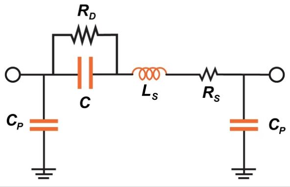

# 射频系统中的耦合和泄漏

------

## 第三章 现实生活中的射频信号

该节主要介绍射频设计和分析中的高频信号在实际电路中移动的复杂方式。

众所周知，射频设计在电气工程的各个子学科中特别具有挑战性，原因之一是理论电信号和高频正弦信号之间极度不一致。从某个时候开始，我们所有人都开始意识到，尽管对电路的逼近度非常不精确，但在理论电路分析中找到的理想化组件，导线和信号还是有帮助的。组件具有容限、温度依赖性和寄生性，电线具有电阻、电容和电感，信号有噪音。但是，设计和实现许多成功的电路时很少考虑这些内容的非理想性。

*实际“电容器”的等效电路模型；在非常高的频率下，它实际上就像一个电感器。*

这是可能的，因为现在有很多电路主要涉及低频或数字信号。低频系统受非理想信号和组件行为的影响要小得多。因此，根据理论分析，低频电路与我们期望的工作相差很小。高频数字系统更容易受到非理想因素的影响，但是这些非理想因素的影响通常并不突出，因为数字通信具有固有的鲁棒性。由于不理想的电路行为，数字信号可能会经历严重的降级，但是只要接收器仍然可以正确地区分逻辑高电平和逻辑低电平，系统便会保持完整的功能。

当然，在RF世界中，信号既不是数字信号也不是低频信号，特殊的信号行为已成为常态，降低的信噪比的每dB都对应于减小的范围，音频质量降低或误码率提高。

### 电容耦合

射频信号绝对不会将自己限制在预期的传导路径内，在PCB板的情况下尤其如此，在PCB板中，各种走线和组件几乎没有物理隔离。

*寄生电容*

典型的电路图由组件、导线和其间的空白区域组成。假设是信号沿导线传播，不能穿过空白区域，但实际上，这些空白空间充满了电容器。每当两个导体被绝缘材料隔开时，就会形成电容，物理距离越近，对应的电容越高。

电容器会阻塞直流电，并会对低频信号产生高阻抗。在低频设计中，我们或多或少可以忽略所有这些意外电容，但是阻抗随频率的增加而降低。在非常高的频率下，PCB充满了由寄生电容产生的相对低阻抗的传导路径。

### 辐射耦合

在理想的世界中，每个RF设备都有一个天线。实际上，从能够发射和接收电磁辐射的意义上讲，每个导体都是天线。因此，辐射耦合提供了另一种方式，RF信号可以通过这种方式穿过原理图符号之间的所谓非导电空白空间。像往常一样，随着频率增加，这个问题变得更加严重。当天线的长度是信号波长的很大一部分时，天线会更有效，因此，当存在高频时，PCB走线（通常很短）会更加成问题。

远场效应，即由不在天线附近的电磁辐射引起的干扰时，术语“辐射耦合”更合适。当发射导体和接收导体之间的距离小于大约一个波长时，就会在近场中发生相互作用。在这种情况下，磁场起主导作用，因此，更准确的术语是“感应耦合”。

### 泄漏

耦合到电路不需要部分的RF信号被描述为“泄漏”。下图描述了一个典型的泄漏示例：

本地振荡器（LO）信号直接馈入混频器的LO输入，这是故意的传导路径。同时，该信号找到了意外的传导路径，并设法泄漏到调音台的另一个输入端口。混合两个频率和相位相同的信号会产生DC偏移（当相位差接近90°或–90°时，偏移的大小朝零减小）。对于将输入信号直接从射频转换为基带频率的接收器架构，此DC偏移构成了主要的设计挑战。

另一个泄漏路径是从混频器通过低噪声放大器到天线：

但是它并不止于此，LO信号可能会被天线辐射，被外部物体反射，然后被同一天线接收。这将再次产生自混合并产生直流偏移，但是在这种情况下，偏移将是高度不可预测的-偏移的幅度和极性将受到反射信号幅度不断变化的影响。

### 发射器和接收器

导致泄漏问题的另一种情况是当RF设备同时包括接收器和发射器时。发射器部分具有功率放大器，该功率放大器设计为将强信号发送到天线，接收器部分设计用于放大和解调非常小幅度的信号。因此，发送器提供高功率，而接收器提供高灵敏度。耦合路径可能会使PA输出泄漏到接收链中，即使是高度衰减的PA信号也可能对敏感的接收器电路造成问题。

### 单面，双面

仅当电路必须支持同时发送和接收时，这种PA到接收器的泄漏才是一个问题。由两个这样的设备（称为收发器，因为它们可以用作发送器和接收器）组成的系统称为全双工。全双工系统可以同时进行双向通信。半双工系统仅支持非同时双向通信，尽管半双工系统中使用的设备仍是收发器，因为它们可以发送和接收。使用半双工设备，我们不必担心从PA到接收器的泄漏，因为在传输过程中接收链没有激活。单向RF通信系统的一个很常见的例子是AM或FM广播，电台的天线发射，汽车收音机接收。

### 总结

* 现实生活中的电信号和组件比理想的电信号和组件更难以预测和分析，对于高频模拟信号更是如此。
* RF信号容易通过电容耦合，辐射耦合和电感耦合产生的意外传导路径。
* RF信号通过其他的传导路径的移动称为泄漏。
* 射频系统可以分为三大类：
  * 全双工（同时双向通讯）
  * 半双工（非同步双向通信）
  * 单纯形（单向通信）