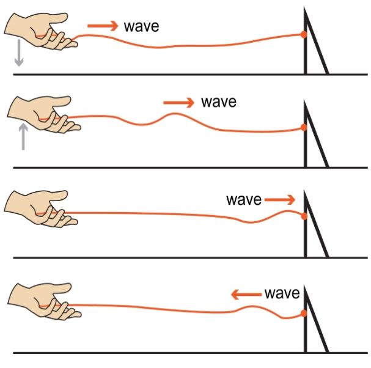
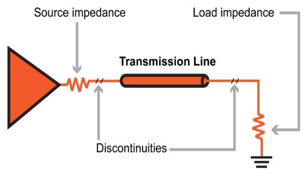
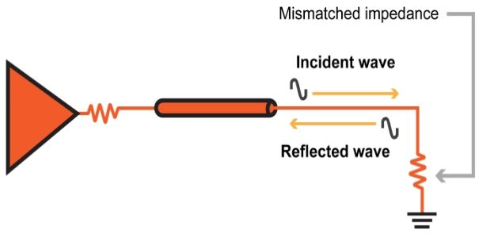

# 射频电路设计中的反射和驻波

------

## 第三章 现实生活中的射频信号

高频电路设计必须面对两个重要的问题：反射和驻波。通过接触其他科学分支，我们知道波动与特殊类型的行为有关。光波从一种介质（例如空气）移动到另一种介质（例如玻璃）时会发生折射。当水波遇到船或大块岩石时，它们会发生衍射。声波会干扰，导致音量周期性变化（称为“拍子”）。

电波还受到我们通常不与电信号关联的行为的影响。但是，对电力的波动本质普遍缺乏了解不足为奇，因为在许多电路中，这些影响可以忽略不计或根本不存在。数字或低频模拟工程师可能需要工作多年并设计出许多成功的系统，而无需全面了解在高频电路中变得越来越突出的波效应。

如上一节所述，受特殊高频信号影响的互连线称为传输线。仅当互连的长度至少为信号波长的四分之一时，传输线效应才有意义。因此，除非我们使用高频或很长的互连，否则我们不必担心波的特性。

### 反射

反射，折射，衍射，干涉-所有这些经典的波特性都适用于电磁辐射。但目前，我们仍在处理电信号，即尚未由天线转换为电磁辐射的信号，因此，我们只需要考虑以下两种情况：反射和干扰。通常，我们将电信号视为一种单向现象。它从一个组件的输出传播到另一组件的输入，换句话说，从源传播到负载。但是，在RF设计中，我们必须始终意识到以下事实：信号可以在两个方向上传播：从源到负载，当然，也由于反射，从负载到源。

*沿着弦传播的波在到达物理屏障时会发生反射。*

### 水浪类比

波浪在不连续时会发生反射。想象一下，一场暴风雨导致大量水浪在平静的港口中传播。这些波最终与坚固的岩壁碰撞。我们凭直觉知道这些波会从岩壁反射并传播回港口。但是，我们还凭直觉知道水浪冲破海滩很少会导致能量显着反射回海洋。为什么会有所不同？波浪传递能量，当水波通过开放水域传播时，这种能量只是在运动。但是，当波到达不连续点时，能量的平滑运动会中断；在海滩或岩墙的情况下，不再可能传播波。但是波浪传递的能量会发生什么呢？它不会消失；它会被吸收或反射。岩壁不吸收波能，因此会发生反射-能量以波的形式继续传播，但方向相反。但是，海滩使波能以更平缓和自然的方式消散。海滩吸收了波的能量，因此反射最小。

### 从水到电

电路也存在影响波传播的不连续性。在这种情况下，关键参数是阻抗。想象一下沿着传输线传播的电波；这相当于大海中间的水浪。该波及其相关能量正在从源到负载平稳传播。最终，电波到达了目的地：天线，放大器等。

从上一节我们知道，当负载阻抗的幅度等于源阻抗的幅度时，就会发生最大的功率传输。 （在这种情况下，“源阻抗”也可以指传输线的特征阻抗。）在阻抗匹配的情况下，实际上并不存在间断，因为负载可以吸收所有波能。但是，如果阻抗不匹配，则仅吸收一部分能量，而剩余的能量将以沿相反方向传播的电波的形式反射。反射能量的大小受源阻抗和负载阻抗之间不匹配的严重性影响。两种最坏的情况是开路和短路，分别对应于无限负载阻抗和零负载阻抗。这两种情况代表完全不连续；无法吸收任何能量，因此所有能量都会被反射。

### 匹配的重要性

如果您参与过RF设计或测试，您就会知道阻抗匹配是讨论的常见话题。现在我们知道必须匹配阻抗以防止反射，但是为什么要如此关注反射呢？

* 第一个问题就是效率。如果我们将功率放大器连接到天线，则我们不希望将一半的输出功率反射回放大器。重点是产生可转换为电磁辐射的电能。通常，我们要将功率从源转移到负载，这意味着反射必须最小化。

* 第二个问题更加微妙。通过传输线传输到负载阻抗不匹配的连续信号将导致连续反射信号。这些入射波和反射波彼此通过，方向相反。干扰导致驻波，即等于入射波和反射波之和的固定波模式。该驻波确实会在电缆的物理长度上产生峰值幅度变化；某些位置的峰值幅度较高，而其他位置的峰值幅度较低。

驻波产生的电压高于发射信号的原始电压，在某些情况下，这种影响严重到足以对电缆或组件造成物理损坏。

### 总结
* 电波容易受到反射和干扰。
* 当水波到达石墙等物理障碍物时会反射。类似地，当AC信号遇到阻抗不连续时，会发生电反射。
* 我们可以通过将负载阻抗与传输线的特征阻抗匹配来防止反射，负载会吸收波能。
* 反射是有问题的，因为它们减少了可以从源传递到负载的功率量。
* 反射也导致驻波，驻波的高振幅部分可能会损坏组件或电缆。