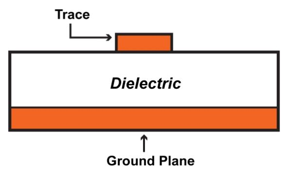
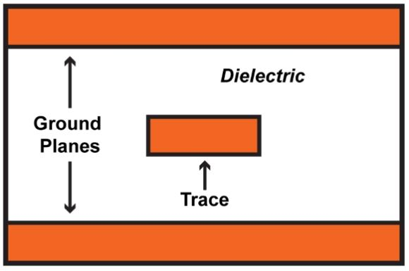
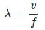
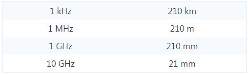
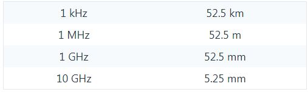
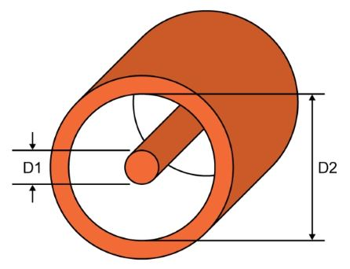
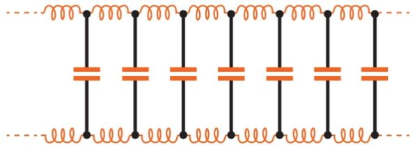

# What Is a Transmission Line

------

## 第三章 现实生活中的射频信号

在低频系统中，组件通过电线或PCB走线连接。这些导电元件的电阻足够低，在大多数情况下可以忽略不计。

电路设计和分析的这一方面随着频率的增加而发生巨大变化。根据我们在低频电路方面的经验，RF信号不会以我们期望的直接方式沿着电线或PCB走线传播。

### 传输线
RF互连的行为与传输低频信号的普通电线的行为有很大不同-实际上不同，传输线是必须根据以下要求进行分析的电缆（或简单地是一对导体）。

首先，让我们澄清两件事：

* 电缆与路径

“电缆”是一个方便但不精确的词，同轴电缆无疑是传输线的经典示例，但是PCB走线也可以用作传输线。 “microstrip”传输线由走线和附近的接地平面组成，如下所示：

“带状线”传输线由PCB走线和两个接地层组成：

PCB传输线特别重要，因为其特性由设计人员直接控制，当我们购买电缆时，其物理特性是固定的，我们只是从数据表中收集必要的信息，在布置RF PCB时，我们可以根据应用需求轻松定制传输线的尺寸，进而定制电气特性。

### 传输线标准

并非每一个高频互连都是传输线，该术语主要是指信号和电缆之间的电气相互作用，而不是指信号的频率或电缆的物理特性。那么，何时需要将传输线效应纳入我们的分析？一般的想法是，当线路的长度等于或大于信号的波长时，传输线的影响就变得很明显。更具体的准则是波长的四分之一：如果互连长度小于信号波长的四分之一，则无需进行传输线分析。互连本身不会显着影响电路的电气行为。如果互连长度大于信号波长的四分之一，则传输线效应会变得很明显，因此必须考虑互连本身的影响。

回想一下，波长等于传播速度除以频率：

如果我们假设传播速度是光速的0.7倍，则我们具有以下波长：

相应的传输线阈值如下：

因此，对于非常低的频率，传输线的影响可以忽略不计。对于中频，仅需特别长的电缆即可。但是，在1 GHz时，许多PCB走线必须被视为传输线，并且随着频率攀升至数十GHz，传输线无处不在。

### 典型阻抗

传输线最重要的特性是典型阻抗（用Z0表示）。总体而言，这是一个非常简单的概念，但最初可能会引起混乱。首先，关于术语的注释：“电阻”是指对任何电流的流动；它不依赖于频率。 “阻抗”在交流电路中使用，通常是指频率相关的电阻。虽然有时我们使用“阻抗”，而“电阻”在理论上更合适；例如，我们可能指的是纯电阻电路的“输出阻抗”。

因此，重要的是要清楚地了解“典型阻抗”的含义。它不是电缆内部信号导体的电阻-常见的特征阻抗为50Ω，而短电缆的50Ω直流电阻将非常高。这里有一些要点有助于阐明特性阻抗的性质：

* 典型阻抗取决于传输线的物理特性：对于同轴电缆，它是内径（下图中的D1），外径（D2）以及内外导体之间绝缘层的相对介电常数的函数。

* 典型阻抗不是电缆长度的函数。它存在于电缆的各处，因为它是由电缆的固有电容和电感引起的。

*在此图中，各个电感器和电容器用来表示在电缆的整个长度上连续存在的分布电容和电感。*

实际上，传输线的阻抗与DC无关，但是理论上无限长的传输线甚至对直流电源（例如电池）也将呈现其特征阻抗。之所以如此，是因为无限长的传输线将永久汲取电流，以尝试为其无限量的分布式电容充电，并且电池电压与充电电流的比值将等于特性阻抗。传输线的特性阻抗是纯电阻性的，没有引入相移，并且所有信号频率都以相同的速度传播。从理论上讲，这仅适用于无损传输线，即，传输线沿导体的电阻为零，导体之间的电阻为无穷大。显然不存在这样的线路，但是当应用于现实生活中的低损耗传输线路时，无损线路分析是足够准确的。

### 反射与匹配

传输线的阻抗无意像普通电阻器那样限制电流。典型阻抗仅仅是由紧密相邻的两个导体组成的电缆之间相互作用的必然结果。在RF设计中，典型阻抗的重要性在于，设计人员必须匹配阻抗，以防止反射并实现最大功率传输，这将在下一节中讨论。

### 总结

* 当互连的长度至少为信号波长的四分之一时，则将其视为传输线。
* 同轴电缆通常用作传输线，尽管PCB走线也可以达到此目的。两条标准的PCB传输线是微带线和带状线。
* PCB互连通常很短，因此，直到信号频率接近1 GHz时，它们才会表现出传输线行为。
* 传输线上的电压与电流之比称为特性阻抗。尽管不受长度影响，但它是电缆物理特性的函数，对于理想化（即无损）线，它是纯电阻性的。