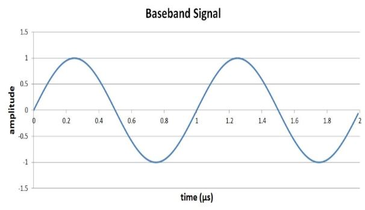
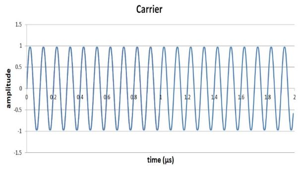
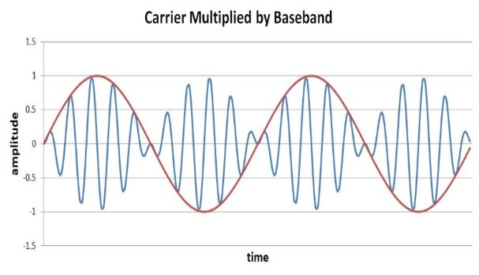
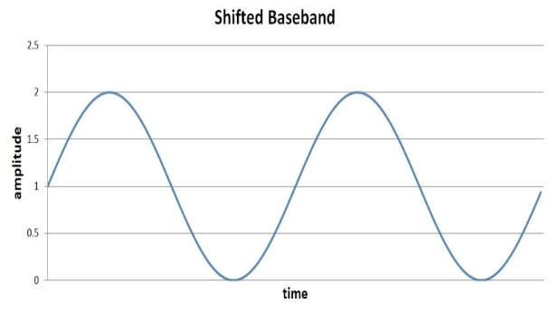
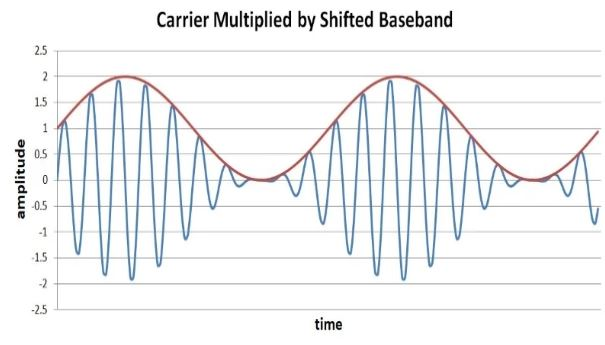
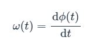
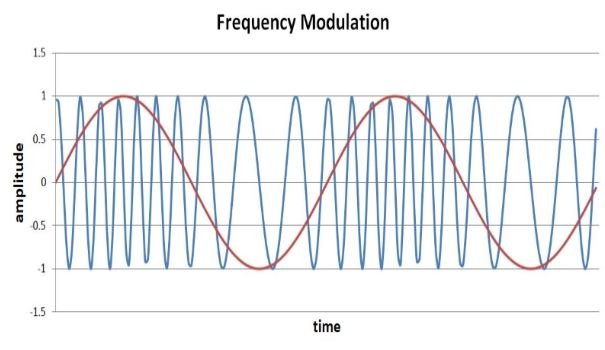

# 多种类型的射频调制

------

## 第四章 射频调制

射频通信建立在一个简单的概念上：我们可以使用不断改变正弦波来传输信息。至此，我们已经涵盖了许多重要概念，这些概念为成功设计和分析实际RF电路和系统奠定了基础。现在，我们准备探索RF工程的一个基本方面：调制。 

### 什么是调制？

动词“调制”的一般含义是“修改，调节，变化”，即使在无线通信的特殊情况下，这也是“调制”的本质。调制信号只是故意地对其进行修改，当然，这种修改是以特定的方式完成的，因为调制的目标是数据信息的传输。

我们要传输信息，如果要处理数字数据，则要传递一个和零，如果要在模拟领域中，则要传递一系列连续变化的值。但是无线通信所施加的限制不允许我们以典型的方式来表达此信息。取而代之的是，我们必须设计一种新的“语言”，否则您可能会认为它是一种代码，它使我们在电磁辐射的系统限制下能够传达相同的信息。更具体地说，我们需要一种与高频正弦信号兼容的语言，因为此类信号构成了典型RF系统中“承载”信息的唯一实际手段。

该用于传送信息的高频正弦波被称为载波。这个名称很直观，因为它提醒我们射频系统的目的不是生成和传输高频正弦波。相反，其目的是传输（低频）信息，而载波只是我们必须使用的将信息从RF发射机移至RF接收机的一种手段。

*先进的调制方案可帮助现代RF系统实现更大的范围传播并提高抗干扰能力。*
 
某些人类语言可能在传达某些类型的信息方面特别有效；以古代世界为例，也许希腊在哲学上更好，而拉丁在编纂法律方面更好。但是，毫无疑问，只要说话者和听者都知道，就可以用任何适当发展的语言进行可靠的交流。射频系统也是如此。每种调制方案都有其优点和缺点，但是，如果满足基本要求，则所有调制方案都可以提供出色的无线通信，也就是说，接收器必须能够理解发射器在说什么。

### 幅度，频率，相位

基本的正弦曲线很简单。如果我们忽略直流偏移，则可以仅用两个参数来完全表征它：幅度和频率。我们还具有相位，当我们考虑正弦曲线的初始状态时，或者当波动特性允许我们将正弦曲线的一部分与前面的部分进行对比时，相位就会发挥作用。比较两个正弦曲线时，相位也很重要。正弦相位的这一概念变得非常重要，因为正交信号（或“ IQ”）在射频系统中的广泛使用，稍后我们将在教科书中介绍IQ概念。

如上所述，调制是修改，我们只能修改已经存在的内容。正弦曲线具有幅度，频率和相位，因此将调制方案归类为幅度调制，频率调制或相位调制就不足为奇了。（实际上，可以通过将幅度调制与频率或相位调制相结合来桥接这些类别。）在每个类别中，我们有两个子类别：模拟调制和数字调制。

### 调幅（AM）
模拟AM包括将连续变化的正弦载波乘以连续变化的信息（又称基带）的偏移量。 “偏移版本”是指基带信号的振幅始终大于或等于零。

假设我们有10 MHz的载波和1 MHz的基带波形：

如果将这两个信号相乘，将得到以下（错误的）波形：

您可以清楚地看到基带信号（红色）和载波幅度（蓝色）之间的关系。但是我们有一个问题：如果仅查看载波的幅度，如何确定基带值是正还是负？幅度解调将不会从调制载波中提取基带信号。解决方案是将基带信号移位，使其从0变到2，而不是-1变到1：

如果将移位后的基带信号乘以载波，我们将得到以下结果：

现在，载波的幅度可以直接映射到基带信号的行为。数字AM的最直接形式是将相同的数学关系应用于振幅为0或1的基带信号。结果称为“开-关键控”（OOK）：当信息信号为逻辑零时，载波的振幅为零（=“off”）；当信息信号为逻辑1时，载波处于全振幅（=“on”）。

### 调频（FM）和调相（PM）
FM和PM密切相关，因为频率和相位密切相关。如果将频率视为每秒的完整周期数，那么每秒周期与正弦曲线在其周期中给定时刻的位置有什么关系是否明显呢？但更有意义的是考虑瞬时频率，即给定时刻的信号频率。（将频率描述为瞬时无疑是自相矛盾的，但是，在实际信号处理的背景下，我们可以放心地忽略与此概念相关的复杂理论细节。）

在基本正弦波中，瞬时频率的值与“正常”频率的值相同。当我们处理具有时变频率的信号时，即频率不是一个恒定值，而是时间的函数，记为ω（t），瞬时频率的分析值就会出现。无论如何，我们当前有关频率和相位之间的紧密关系的讨论的重点如下：瞬时角频率是相位相对于时间的导数。因此，如果您有一个描述信号相位的时变行为的表达式φ（t），则φ（t）的变化率（相对于时间）将为您提供瞬时角频率的表达式：

在本章的后面，我们将仔细研究频率和相位调制。现在，让我们以下面的图表为结尾，该图表将频率调制的数学关系应用于上面使用的基带和载波信号：

### 总结
* 调制是指仔细修改现有信号以使其可以传输信息的过程。
* 在射频的情况下，现有信号称为载波，信息包含在基带信号中。
* 有许多不同的调制方案，这意味着有不同的方式将基带信息合并到正弦波中。
* 调制涉及修改载波的幅度，频率或相位，可用于传输模拟信号或数字数据。
