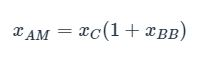

# RF中的振幅调制：理论，时域，频域

------

## 第四章 射频调制

本小节主要了解有关在载波波形中编码信息的方法。

我们已经看到，RF调制仅仅是对正弦载波信号的幅度，频率或相位的进行修改。根据由发射机实现并且由接收机理解的特定方案来执行该修改。幅度调制（术语“ AM无线电”的起源）根据基带信号的瞬时值来改变载波的幅度。

### 数学原理

幅度调制的数学关系简单而直观：将载波乘以基带信号。载波本身的频率不会改变，但是幅度会根据基带值不断变化。 （但是，正如我们稍后将看到的那样，幅度变化引入了新的频率特性。）这里一个微妙的细节是需要对基带信号进行移位。我们在上一节中对此进行了讨论，如果我们的基带波形在–1到+1之间变化，则数学关系可以表示为：

其中XAM是调幅波形，xC是载波，xBB是基带信号。如果我们认为载波是一个无休止的，恒定幅度的，固定频率的正弦波，则可以采取进一步的措施。如果我们假设载波幅度为1，则可以将xC替换为sin（ωCt）。

到目前为止，一切如你所见，但是这种关系存在一个问题：您无法控制调制的“强度”。换句话说，基带变化到载波幅度变化的关系是固定的。例如，我们不能设计这样的系统，即基带值的微小变化将导致载波幅度的较大变化。为了解决这个限制，我们引入了m，称为调制指数。

现在，通过改变m，我们可以控制基带信号对载波幅度的影响强度。但是请注意，m是乘以原始基带信号，而不是移位后的基带。因此，如果xBB从–1扩展到+1，则任何大于1的m值都将导致（1 + mxBB）扩展到y轴的负数部分–但这正是我们试图通过移动来避免的它向上。因此请记住，如果使用调制指数，则必须基于m*xBB而不是xBB的最大幅度来移动信号。

### 时域

我们在上一节中介绍了AM时域波形。这是最终的绘图（红色的基带，蓝色的AM波形）：

现在，让我们看一下调制指数的效果。这是一个类似的图，但是这次我通过加3而不是1来偏移基带信号（原始范围仍然是–1到+1）。

现在，我们将合并一个调制指数。下图是m = 3。

现在，载波的幅度对基带信号的变化值“更加敏感”。偏移的基带不会进入y轴的负部分，因为我根据调制指数选择了DC偏移。您可能想知道的是：如何在不知道基带信号确切幅度特征的情况下选择正确的DC偏移？换句话说，我们如何确保基带波形的负摆幅精确地延伸到零？答：不需要。前两个图是同样有效的AM波形。在这两种情况下，基带信号都会如实传输。解调后残留的任何直流失调都可以通过串联电容器轻松消除。 （下一章将介绍解调。）

### 频域

如本教程第二节所述，RF开发广泛使用频域分析。我们可以通过使用频谱分析仪进行测量来检查和评估现实生活中的调制信号，但这意味着我们需要了解频谱的外观。

让我们从载波信号的频域表示开始：

这正是我们对未调制载波的期望：10 MHz处的单个尖峰。现在，让我们看一下通过使用1 MHz恒定频率正弦波对载波进行幅度调制来创建的信号频谱。

在这里，您可以看到调幅波形的标准特性：基带信号已根据载波频率进行了移位。您也可以认为这是将基带频率“添加”到载波信号上，这的确是我们在使用幅度调制时所做的事情-载波频率保持不变，正如您在时域波形中看到的那样，但是幅度变化构成了对应于基带信号频谱特征的新频率内容。

如果我们更仔细地观察调制频谱，我们可以看到两个新的峰值分别在载波频率之上1 MHz（即基带频率）处和载波频率之下1 MHz处：

（上图的不对称性是计算过程产生的；这些图是使用有限分辨率的真实数据生成的，理想化的光谱将是对称的。）

### 负频率

总而言之，幅度调制将基带频谱转换为以载波频率为中心的频带。但是，我们需要解释一些事情：为什么会有两个峰值-一个在载波频率加基带频率处，而另一个在载波频率减去基带频率处？如果我们仅记得傅立叶谱关于y轴是对称的，答案就很清楚，即使我们通常只显示正频率，x轴的负部分也包含相应的负频率。在处理原始频谱时，这些负频率很容易被忽略，但是在移动频谱时，必须包括负频率。

下图应说明这种情况。

如您所见，基带频谱和载波频谱相对于y轴对称。对于基带信号，这会导致频谱从x轴的正向部分连续延伸到负向部分；对于载波，我们只是有两个尖峰，一个在+ωC，一个在–ωC。而且AM频谱再次是对称的：转换后的基带频谱出现在x轴的正向和负向部分。

还有一点要记住：调幅会使带宽增加2倍。我们仅使用正频率来测量带宽，因此基带带宽就是BWBB（请参见下图）。但是在转换完整个频谱（正和负频率）后，所有原始频率都变为正，因此调制带宽为2BWBB。

### 总结
* 幅度调制对应于将载波乘以移位后的基带信号。
* 调制指数可用于使载波幅度对基带信号值的变化更加（或更小）敏感。
* 在频域中，幅度调制对应于将基带频谱转换为载波频率周围的频带。
* 因为基带频谱关于y轴对称，所以这种频率转换导致带宽增加2倍。