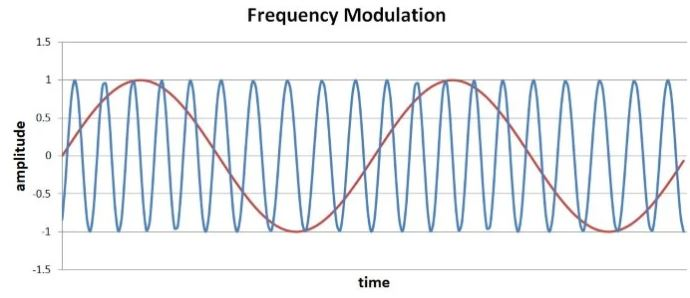

# 调频：理论，时域，频域

------

## 第四章 射频调制

尽管没有幅度调制直观，但是频率调制仍然是无线数据传输的一种相当简单的方法。

我们都对调频有些陌生，这就是“调频广播”一词的由来。如果我们认为频率是具有瞬时值的东西，而不是由几个周期除以相应的时间段组成的东西，说以可以根据基带信号的瞬时值连续改变频率。

### 数学

在本章的第一页中，我们讨论了称为瞬时频率的反常量。如果您不熟悉此术语或感到困惑，请返回该页面并仔细阅读“频率调制（FM）和相位调制（PM）”部分。但是，您可能仍然不确定，这是可以理解的—瞬时频率的概念违反了基本原理，即“频率”表示信号完成一个完整周期的频率：每秒十次，每秒百万次，或者可能是这样。我们不会尝试将瞬时频率作为数学概念进行彻底或全面的处理。 （如果您决定深入探讨此问题，请参考以下学术论文。）在FM的情况下，重要的是要意识到，由于载波频率的变化，瞬时频率自然会随之产生连续响应调制波（即基带信号）。基带信号的瞬时值会影响特定时刻的频率，而不是一个或多个完整周期的频率。

实际上，尽管如此，这仅适用于模拟FM。对于数字FM，一位对应于离散数量的周期。这导致了一种有趣的情况，即较旧的技术（模拟FM）不如较新的技术（数字FM，也称为频移键控或FSK）直观。

*您无需考虑瞬时频率即可了解数字频率调制。*

和上一节一样，我们将载波写为sin（ωCt）。它已经有一个频率（即ωC），因此我们将使用术语“多余频率”来指代调制过程所贡献的频率分量。但是，该术语会产生误导，因为“过剩”表示较高的频率，而调制会导致载波频率高于或低于标称载波频率。实际上，这就是为什么频率调制（与幅度调制相比）不需要偏移的基带信号的原因：正基带值会增加载波频率，而负基带值会降低载波频率。在这些条件下，解调不是问题，因为所有基带值都映射到唯一的频率。

无论如何，回到我们的载波信号：sin（ωCt）。如果将基带信号（xBB）加到括号内的数量，我们将使多余相位与基带信号线性成比例。但是，我们正在寻找的是频率调制，而不是相位调制，因此我们希望多余的频率与基带信号成线性比例。从本章的第一页我们知道，我们可以通过取相对于时间的相位导数来获得频率。因此，如果我们希望频率与xBB成正比，我们就必须不加基带信号本身，而要加基带信号的积分（因为取导数会抵消积分，而剩下的就是xBB作为多余频率 ）。

我们唯一需要添加的是调制指数m。在上一页中，我们看到了调制指数可用于使载波的幅度变化或多或少地对基带值变化敏感。它在FM中的功能是等效的：调制指数使我们可以微调由基带值的变化产生的频率变化的强度。

### 时域

让我们看一些波形。这是我们的10 MHz载波：

基带信号将是1 MHz正弦波，如下所示：

FM波形是通过应用上述公式生成的。 sin（x）的积分是–cos（x）+C。常数C在这里无关紧要，因此我们可以使用以下公式计算FM信号：

结果如下（基带信号显示为红色）：

载波几乎没有变化，但是如果您仔细观察，当基带信号接近最大值时，峰值会稍微靠近。所以我们这里确实有调频；问题是基带变化不能产生足够的载频变化。我们可以通过增加调制指数轻松地纠正这种情况。让我们使用m = 4：

现在，我们可以更清楚地看到调制载波的频率如何连续跟踪瞬时基带值

### 频域

同一基带和载波信号的AM和FM时域波形看起来非常不同。因此，有趣的是发现AM和窄带FM在频域中产生相似的变化。 （窄带FM涉及有限的调制带宽，并且可以简化分析。）在两种情况下，低频频谱（包括负频率）都转换为在载波频率之上和之下延伸的频带。使用AM时，基带频谱本身会向上移动。对于FM，出现在载波频率周围频带中的是基带信号积分的频谱。

对于上面显示的单基带频率m-equals-1调制，我们具有以下几点：

下一个频谱是m = 4：

这非常清楚地表明，调制指数会影响调制波形的频率内容，调频的频谱分析比调幅的频谱分析要复杂得多，很难预测调频信号的带宽。

### 总结
* 频率调制的数学表示由正弦表达式组成，基带信号的积分被添加到正弦或余弦函数的自变量中。
* 调制指数可用于使频率偏差对基带值的变化更敏感或更不敏感。
* 窄带频率调制导致基带信号积分的频谱转换为载频周围的频带。
* FM频谱受调制指数以及调制信号幅度与调制信号频率之比的影响。