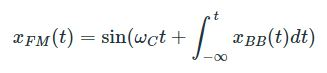
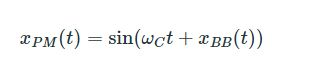
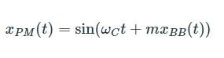
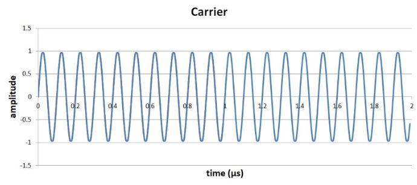
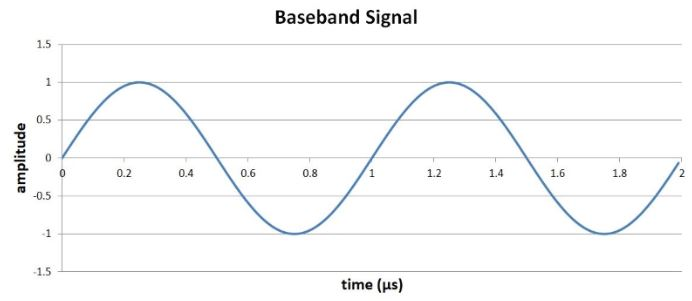
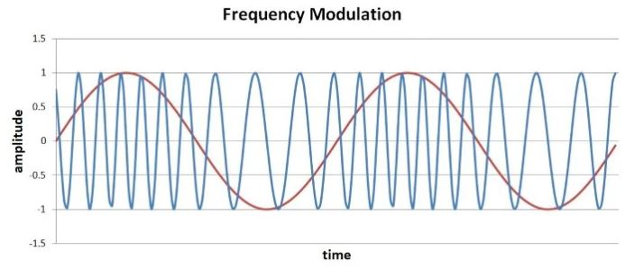
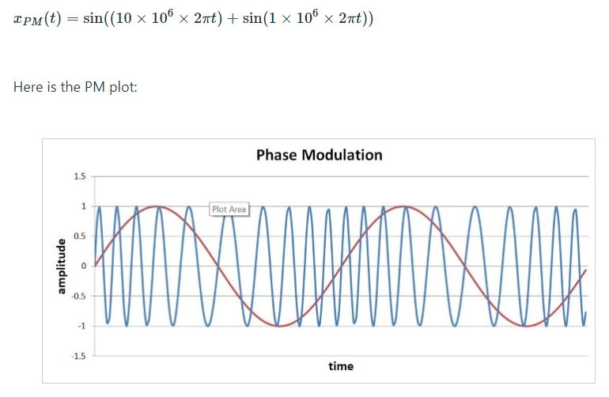
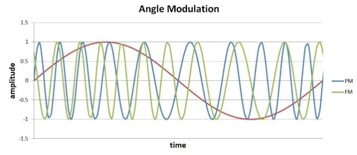
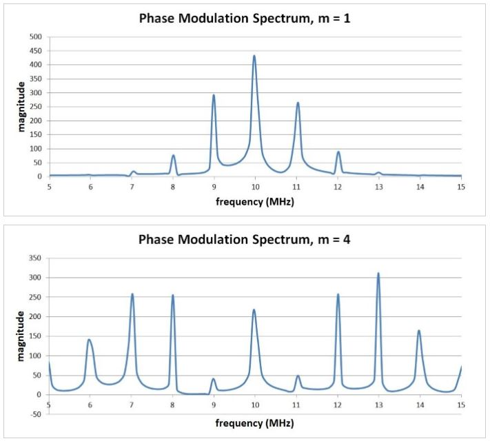

# 相位调制：理论，时域，频域

------

## 第四章 射频调制

相位调制类似于频率调制，并且是数字通信系统中的一项重要技术。我们都听说过AM广播和FM广播。但是相位调制似乎属于不同的类别---“PM无线电”绝不是一个通用术语。事实证明，相位调制在数字RF的环境中更为重要。从某种意义上讲，我们可以说PM无线电与FM无线电一样普遍，只是因为相位调制和频率调制之间几乎没有差异。 FM和PM最好被认为是角度调制的两个紧密相关的变体，其中“角度”是指传递给正弦或余弦函数的量的修改。

### 数学原理

我们在上一节中看到，通过将基带信号的积分添加到正弦或余弦函数的参数（其中正弦或余弦函数表示载波）来实现频率调制：

您可能还记得，我们是通过首先讨论相位调制来介绍频率调制的：添加基带信号本身而不是基带信号的积分会导致相位根据基带值而变化。因此，相位调制实际上比频率调制简单一些。

与频率调制一样，我们可以使用调制指数使相位变化对基带值的变化更加敏感：

如果考虑单频基带信号，则相位调制和频率调制之间的相似性变得很明显。假设xBB（t）= sin（ωBBt）。正弦的积分是负余弦（加上一个常数，在这里可以忽略），换句话说，积分只是原始信号的时移形式。因此，如果我们对该基带信号执行相位调制和频率调制，则调制波形的唯一区别将是基带值与载波变化之间的对齐；变体本身是相同的。在下一部分中，我们将更清楚地看到一些时域图。

请记住，我们正在处理瞬时相位，就像调频是基于瞬时频率的概念一样。术语“阶段”相当模糊。一种熟悉的含义是指正弦曲线的初始状态。例如，“正常”正弦波从零开始，然后向其最大值增加。从其周期的不同点开始的正弦波具有相位偏移。我们还可以将相位视为整个波形周期的特定部分。例如，在π/ 2的相位上，正弦曲线已完成其周期的四分之一。

当我们处理一个随基带波形不断变化的相位时，这些对“相位”的解释对我们没有太大帮助。而是，我们使用瞬时相位的概念，即在给定时刻的相位，它对应于（在给定时刻）传递给三角函数的值。我们可以将瞬时相位的这些连续变化视为将载波值“推”到离波形的先前状态更近或更近的位置。

还有一点要记住：Trig函数（包括正弦和余弦）在角度上起作用。更改触发函数的自变量等效于更改角度，这解释了为什么将FM和PM都描述为角度调制。

### 时域

我们将使用与FM讨论相同的波形，即10 MHz载波和1 MHz正弦基带信号：

这是我们在上一节中看到的FM波形（m = 4）：

我们可以使用以下等式计算PM波形，其中添加到载波自变量的信号使用正弦（即原始信号）而不是负余弦（即原始信号的积分）。

在讨论这一点之前，让我们先看一下显示FM波形和PM波形的图：

首先想到的是，从视觉的角度来看，FM比PM更直观-调制波形的较高和较低频率部分与较高和较低基带值之间存在清晰的视觉联系。使用PM时，基带波形和载波行为之间的关系可能不是立即显而易见的。但是，经过一些检查，我们可以看到PM载波频率与基带波形的斜率相对应。最高频率部分出现在xBB的最陡的正斜率上，而最低频率部分出现在最陡的负斜率。

这是有道理的：回想一下，频率（作为时间的函数）是相位的导数（作为时间的函数）。利用相位调制，基带信号的斜率决定了相位变化的速度，以及相位变化的速率等于频率。因此，在PM波形中，高基带斜率对应于高频，而低基带斜率对应于低频。对于频率调制，我们使用xBB的积分，其作用是将高（或低）频率载波部分移到基带波形的高（或低）斜率部分之后的基带值。

### 频域

前面的时域图展示了前面所说的内容：频率调制和相位调制非常相似。因此，毫不奇怪，PM在频域中的作用类似于FM。以下是用于上述载波和基带信号的相位调制的频谱：

### 总结

* 通过将基带信号加到代表载波的正弦或余弦函数的自变量中来计算相位调制。
* 调制指数使相位变化或多或少地对基带信号的行为敏感。
* 相位调制的频域效应类似于频率调制的频域效应。
* 模拟相位调制并不常见。但是，数字相位调制被广泛使用。