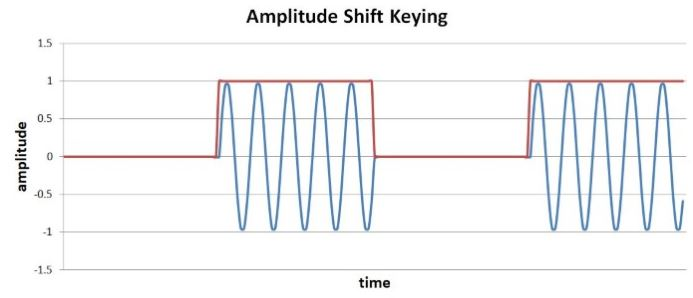
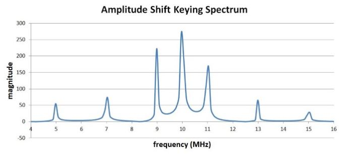
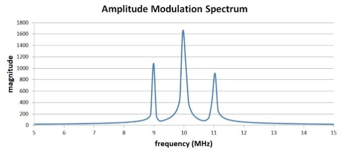
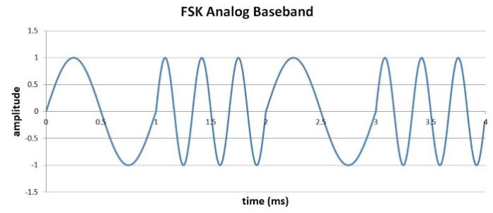
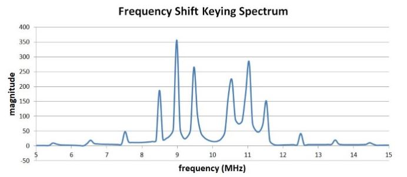

# 数字调制：幅度和频率

------

## 第四章 射频调制

尽管基于相同的概念，但数字调制波形看上去与模拟波形完全不同。我们不再专注于将模拟波形从一个地方移动到另一个地方。相反，我们要移动数据：无线网络，数字化音频信号，传感器测量等等。为了传输数字数据，我们使用数字调制。

但是，我们必须谨慎使用该术语。在本文中，“模拟”和“数字”是指要传输的信息的类型，而不是实际传输波形的基本特征。模拟和数字调制均使用平滑变化的信号。区别在于模拟调制信号被解调为模拟基带波形，而数字调制信号由离散的调制单元（称为符号）组成，这些符号被解释为数字数据。

### 数字幅度调制

这种调制方式称为幅度偏移键控（ASK）。最基本的情况是“开-关键控”（OOK），它几乎直接对应于[模拟幅度调制]，如果我们将数字信号用作基带波形，则乘法基带和载波产生的调制波形对于逻辑高电平来说是正常的，而对于逻辑低电平则是“关”的，逻辑高振幅对应于调制指数。

### 时域

下图显示了使用10 MHz载波和1 MHz数字时钟信号生成的OOK。我们在这里在数学领域中进行操作，因此逻辑高振幅（和载波振幅）仅为“ 1”；在实际电路中，您可能具有1 V的载波波形和3.3 V的逻辑信号。

您可能已经注意到，此示例与[振幅调制]小节中讨论的数学关系之间存在一个不一致的地方：我们没有移动基带信号。如果您要处理典型的直流耦合数字波形，则无需上移，因为信号保持在y轴的正向部分。

### 频域

下图是对应的频域

将此与使用1 MHz正弦波进行幅度调制的频谱进行比较：

大多数频谱是相同的-载波频率（fC）的尖峰和fC加基带频率和fC减去基带频率的尖峰。但是，ASK频谱的尖峰也较小，分别对应于三次谐波和第五次谐波：基频（fF）为1 MHz，这意味着三次谐波（f3）为3 MHz，第五次谐波（f5）为5 MHz 。因此，我们在fC正负fF，f3和f5处有尖峰。实际上，如果您要扩大绘图，您会看到峰值按照此模式继续出现。方波的傅立叶变换由基频的正弦波和奇次谐波的振幅减小的正弦波组成，该谐波含量就是我们在上面所示频谱中看到的。讨论将我们引向一个重要的实践点：与数字调制方案相关的突然转变会产生（不希望的）更高的频率含量。在考虑调制信号的实际带宽以及可能干扰其他设备的频率时，必须牢记这一点。

### 数字调频

这种调制方式称为频移键控（FSK）。就我们的目的而言，没有必要考虑FSK的数学表达式。相反，我们可以简单地指定当基带数据为逻辑0时频率为f1，当基带数据为逻辑1时频率为f2。

### 时域

生成准备发送的FSK波形的一种方法是，首先创建一个根据数字数据在f1和f2之间切换的模拟基带信号。这是f1 = 1 kHz和f2 = 3 kHz的FSK基带波形的示例。为确保符号与逻辑0和逻辑1的持续时间相同，我们使用一个1 kHz周期和三个3 kHz周期。

然后将基带波形（使用混频器）上移至载波频率并发送。这种方法在软件定义的无线电系统中特别方便：模拟基带波形是低频信号，因此可以通过数学方式将其生成，然后由DAC引入模拟领域。使用DAC创建高频传输信号会困难得多。从概念上讲，更简单的实现FSK的方法是简单地使两个载波信号具有不同的频率（f1和f2）。根据二进制数据的逻辑电平，将一个或另一个路由到输出。这导致最终的发射波形在两个频率之间突然切换，与上面的基带FSK波形非常相似，不同之处在于两个频率之间的差异相对于平均频率要小得多。换句话说，如果您正在查看时域图，则很难从视觉上区分f1部分和f2部分，因为f1和f2之间的差异只是f1（或f2）的一小部分。

### 频域

让我们看一下FSK在频域中的影响。我们将使用相同的10 MHz载波频率（在这种情况下，即平均载波频率），并且将使用±1 MHz作为偏差。（这是不现实的，但是对于我们当前的目的是方便的。）因此，逻辑0的传输信号将为9 MHz，逻辑1的传输信号将为11 MHz。这是频谱：

请注意，“载波频率”没有能量。考虑到调制信号永远不会处于10 MHz，这不足为奇。它始终处于10 MHz减去1 MHz或10 MHz加上1 MHz的位置，这正是我们看到两个主要峰值的地方：9 MHz和11 MHz。

但是该频谱中是否存在的其他频率呢？FSK频谱分析并不是特别简单。我们知道，频率之间的突然转变会带来额外的傅立叶能量。事实证明，FSK会为每个频率产生正弦函数类型的频谱，即，一个频率以f1为中心，另一个频率以f2为中心。这些说明了在两个主要尖峰两侧各出现的额外频率尖峰。

### 总结
* 数字调幅涉及根据二进制数据在离散部分中改变载波的幅度。
* 数字调幅最直接的方法是开关键控。
* 利用数字频率调制，载波或基带信号的频率根据二进制数据在离散的部分中变化。
* 如果将数字调制与模拟调制进行比较，我们会发现由数字调制产生的突然转变会在远离载波的频率处产生额外的能量。