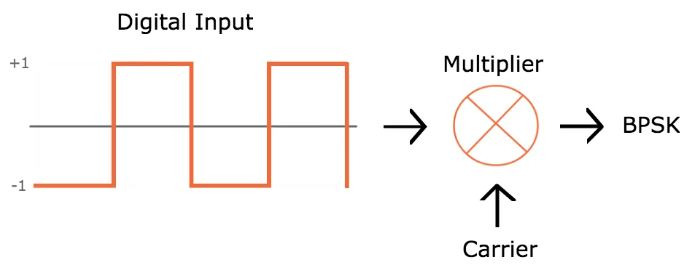
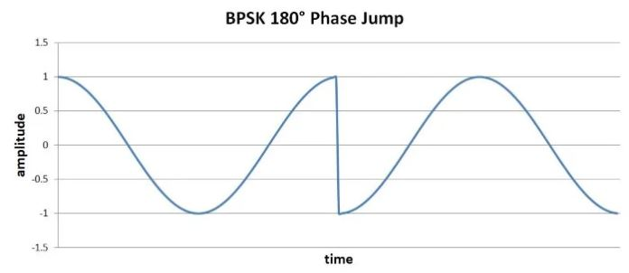
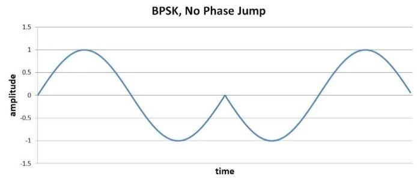
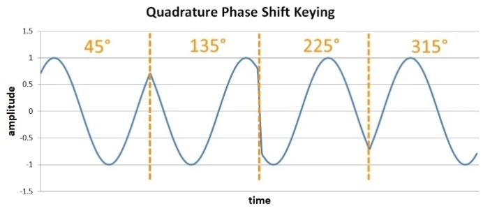
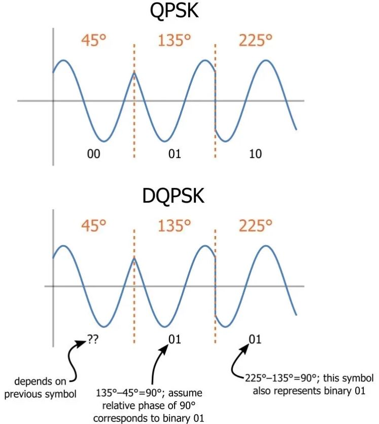

# 数字调相：BPSK，QPSK，DQPSK

------

## 第四章 射频调制

数字相位调制是一种无线传输数字数据的通用且广泛使用的方法。在上一节中，我们看到了可以使用载波幅度或频率中的离散变化来表示一和零的方式。我们也可以使用相位表示数字数据，这不足为奇。这种技术称为相移键控（PSK）。

### 二进制相移键控（BPSK）

相移键控（PSK）的最直接类型称为二进制相移键控（BPSK），其中“二进制”是指使用两个相移（一个用于逻辑高，一个用于逻辑低）。

我们可以凭直觉认识到，如果这两个相位之间的间隔更大，则系统将更加健壮-当然，接收机将很难区分相位偏移为90°的符号和相位偏移为91°的符号。 我们只有360°的相位可以使用，因此逻辑高和逻辑低相位之间的最大差为180°。但是我们知道，将正弦曲线移动180°等同于将其反转。因此，我们可以将BPSK视为响应一个逻辑状态简单地将载波反转，而响应另一个逻辑状态则将其保留下来。

更进一步，我们知道正弦乘以负的正弦与反转正弦是相同的，这导致使用以下基本硬件配置来实现BPSK的可能性：

但是，这种方案很容易导致载波波形发生高斜率跃迁：如果在载波处于最大值时逻辑状态之间发生跃迁，则载波电压必须迅速移至最小电压。

诸如此类的高斜率事件是不希望的，因为它们会产生可能干扰其他RF信号的高频能量。而且，放大器在输出电压中产生高斜率变化的能力有限。如果我们通过两个附加功能完善上述实现，则可以确保符号之间的平滑过渡。首先，我们需要确保数字位周期等于一个或多个完整的载波周期。其次，我们需要将数字转换与载波波形同步。通过这些改进，我们可以设计系统，使得当载波信号在零交叉处（或非常接近零交叉处）时发生180°的相位变化。

### 正交相移键控（QPSK）

BPSK每个符号传输一位，这是我们目前为止所习惯的。关于数字调制的所有讨论都假设根据数字电压是逻辑低还是逻辑高来修改载波信号，并且接收器通过将每个符号解释为0或1来构造数字数据。在讨论正交相移键控（QPSK）之前，我们需要引入以下重要概念：没有理由一个符号只能传输一位。在数字电子世界是建立在电压处于一种或另一种极端的电路中的，因此电压始终代表一个数字位。但是射频不是数字的，我们使用的是模拟波形来传输数字数据，因此需要设计一种可以接受的系统，在该系统中，对模拟波形进行编码和解释的方式允许一个符号代表两个（或多个）位。

QPSK是一种调制方案，它允许一个符号传输两位数据。有四个可能的两位数字（00、01、10、11），因此我们需要四个相位偏移。同样，我们希望相位选项之间的最大间隔，在这种情况下为90°。

优势是更高的数据速率：如果我们保持相同的符号周期，则可以将数据从发送器移到接收器的速率增加一倍。缺点是系统复杂度。 （您可能会认为QPSK比BPSK还要容易受到误码的影响，因为可能的相位值之间的间隔较小。这是一个合理的假设，但是如果进行数学计算，结果发现错误概率实际上是非常相似。）

### 变体

总体而言，QPSK是一种有效的调制方案，我们可以改继续改善这种调制方式。

* 相跳

标准QPSK保证将发生高斜率符号到符号的转换；因为相位跳变可以为±90°，所以我们无法将上述方法用于BPSK调制产生的180°相位跳变。通过使用两个QPSK变体之一，可以缓解此问题。偏移QPSK涉及在调制过程中使用的两个数字数据流之一中增加延迟，从而将最大相位跳变降低至90°。另一个选择是π/ 4-QPSK，它将最大相位跳变减小到135°。因此，偏移QPSK在减少相位不连续性方面是优越的，但是π/ 4-QPSK是有利的，因为它与差分编码兼容（在下一小节中讨论）。处理符号间不连续性的另一种方法是实施额外的信号处理，以在符号之间创建更平滑的过渡。该方法被合并到称为最小移位键控（MSK）的调制方案中，并且对称为高斯MSK的MSK也进行了改进。

* 差分编码

另一个困难是，PSK波形的解调比FSK波形的解调更困难。频率是“绝对的”，因为可以始终通过分析信号随时间的变化来解释频率变化。但是，相位在没有通用参考的意义上是相对的-发射器会参考某个时间点生成相位变化，而接收器可能会参考一个单独的时间点来解释相位变化。其实际表现如下：如果用于调制和解调的振荡器的相位（或频率）之间存在差异，则PSK变得不可靠。并且我们必须假设会有相位差（除非接收器包含载波恢复电路）。差分QPSK（DQPSK）是与非相干接收机（即，不将解调振荡器与调制振荡器同步的接收机）兼容的一种变体。差分QPSK通过产生相对于前一个符号的特定相移来编码数据。通过以这种方式使用前一个符号的相位，解调电路使用接收机和发射机共用的参考来分析符号的相位。

### 总结

* 二进制相移键控是一种简单的调制方案，可以每个符号传输一位。
* 正交相移键控更为复杂，但会使数据速率增加一倍（或以一半的带宽获得相同的数据速率）。
* 偏移QPSK，π/ 4-QPSK和最小移位键控是调制方案，可减轻高斜率符号间符号电压变化的影响。
* 差分QPSK使用相邻符号之间的相位差来避免与发射机和接收机之间缺乏相位同步相关的问题。