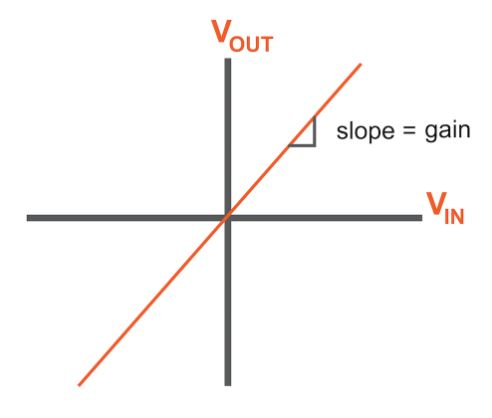
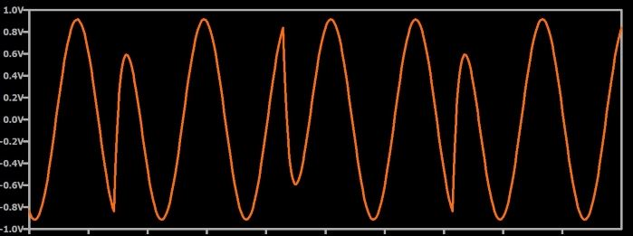

# 比较幅度、频率和相位调制

------

## 第四章 射频调制

不同的调制方案在性能和应用方面如何比较？了解这三种RF调制的显着特征非常重要，这些信息并不是孤立存在的，其目标是设计有效且高效地满足性能目标的实际系统。因此，我们需要大致了解哪种调制方案适合特定应用。

### 调幅

就实现和分析而言，幅度调制非常简单。而且，AM波形相当容易解调。总体而言，AM可以看作是一种简单的低成本调制方案。但是，与往常一样，简单性和低成本伴随而来的是性能妥协，即使我们从来没有想到更简单，更便宜的解决方案是最佳解决方案。将AM系统描述为“稀有”可能并不准确，因为全世界有无数的车辆都包含AM接收器。但是，由于AM具有两个明显的缺点，因此模拟幅度调制的应用目前非常有限。

除AM无线电广播外，模拟幅度调制还用于民航。

### 振幅噪声

噪声是无线通信系统中的永久难题。从某种意义上说，RF设计的质量可以通过解调信号的信噪比来概括：接收信号中的噪声越少意味着输出质量越高（对于模拟系统）或比特错误就越少（对于数字系统）。噪声始终存在，我们始终必须将其视为对系统整体性能的根本威胁。

噪声-随机的电噪声，干扰，电气和机械瞬变-对信号的大小起作用。换句话说，噪声会产生幅度调制。这是一个问题，因为不能将由噪声引起的随机幅度调制与发射机执行的故意幅度调制区分开。噪声对于任何RF信号都是一个问题，但是AM系统尤其容易受到影响。

### 放大器线性度

射频功率放大器设计的主要挑战之一是线性度。 （更具体地说，很难同时实现高效率和高线性度。）用图形表示，线性放大器的传递函数只是一条直线，其斜率对应于增益。

*一条直线表示一个完美线性放大器的响应：输出电压始终是输入电压乘以固定增益。*

实际放大器始终具有一定程度的非线性，这意味着施加到输入信号的增益会受到输入信号特性的影响。非线性放大的结果是失真，即在谐波频率下产生频谱能量。我们也可以说非线性放大是幅度调制的一种形式。如果放大器的增益根据输入信号的频率或根据外部因素（例如温度或电源条件）而变化，则传输的信号正在经历意外（且不希望的）幅度调制。这在AM系统中是一个问题，因为寄生幅度调制会干扰故意幅度调制。任何包含幅度变化的调制方案都更容易受到非线性影响。这包括普通的模拟幅度调制和广泛使用的数字方案，统称为正交幅度调制（QAM）。

### 角度调制

频率和相位调制将信息编码为已发射信号的时间特性，因此它们对幅度噪声和放大器非线性具有鲁棒性。信号的频率不能因噪声或失真而改变。可以添加其他频率内容，但是原始频率仍然存在。当然，噪声确实会对FM和PM系统产生负面影响，但是噪声不会直接破坏用于编码基带数据的信号特性。如上所述，功率放大器的设计需要在效率和线性之间进行权衡。角度调制与低线性放大器兼容，并且这些低线性放大器在功耗方面更为有效。因此，角度调制是低功率RF系统的不错选择。

### 带宽

幅度调制的频域效应比频率调制和相位调制更为直接。这可以被认为是AM的优势：重要的是能够预测调制信号占用的带宽。但是，预测FM和PM频谱特征的难度与设计的理论部分更为相关。如果我们专注于实际考虑，角度调制将被认为是有利的，因为它可以将给定的基带带宽转换为稍小的（与AM相比）传输带宽。

### 频率与相位

频率调制和相位调制密切相关；但是，在某些情况下，一个是比另一个更好的选择。两者之间的差异在数字调制中更为明显。

### 模拟频率和相位调制

正如我们在调相页面中所见，当基带信号为正弦波时，PM波形只是相应FM波形的移位版本。因此，就频谱特性或噪声敏感性而言，FM与PM之间没有主要利弊也就不足为奇了。但是，模拟FM比模拟PM更为常见，原因是FM调制和解调电路更简单。例如，可以利用围绕电感器和压控电容器（即，响应于基带信号的电压而经历电容变化的电容器）构建的振荡器这样简单的事情来实现频率调制。

### 数字频率和相位调制

当我们进入数字调制领域时，PM和FM之间的差异变得非常重要。首先要考虑的是误码率。显然，任何系统的误码率都将取决于各种因素，但是，如果我们将二进制PSK系统与等效的二进制FSK系统进行数学比较，则会发现二进制FSK需要更多的发射能量才能达到相同的误码率,这是数字相位调制的优点。

但是普通的数字PM也有两个明显的缺点。如数字相位调制章节中所述，普通（即非差分）PSK与非相干接收机不兼容。相反，FSK不需要相干检测。普通的PSK方案，尤其是QPSK，涉及突然的相位变化，导致高斜率信号变化，并且当信号由低通滤波器处理时，波形的高斜率部分幅度减小。这些幅度变化与非线性放大相结合会导致一个称为频谱再生长的问题。为了减轻频谱再生，我们可以使用线性度更高（因此效率更低）的功率放大器，也可以实施专用版本的PSK。或者我们可以切换到FSK，而无需突然改变相位。

*在这里，您可以看到由对PSK信号进行低通滤波引起的幅度变化。*

### 总结

* 幅度调制很简单，但是容易受到噪声的影响，因此需要高线性度的功率放大器。
* 调频不太容易受到幅度噪声的影响，可以与效率更高，线性度较低的放大器一起使用。
* 数字相位调制在误码率方面比数字频率调制提供了更好的理论性能，但是数字FM在低功率系统中具有优势，因为它不需要高线性度的放大器。