# 如何解调AM波形

------

## 第五章 射频解调

了解两个电路，它们可以从调幅载波信号中提取原始信息。在这一点上，我们知道调制指的是有意修改正弦波，以便它可以将低频信息从发射机传送到接收机。我们还讨论了与载波编码信息的不同方法（幅度，频率，相位，模拟，数字）有关的许多细节。

但是，如果我们不能从接收信号中提取数据，就没有理由将数据集成到发射信号中，这就是为什么我们需要研究解调的原因。解调电路的范围从简单的修改峰值检测器到复杂的相干正交下变频以及数字信号处理器执行的复杂解码算法。

### 创建信号

我们将使用LTspice研究解调AM波形的技术。但是在解调之前，我们需要先进行调制。在AM调制页面中，我们看到生成AM波形需要四件事。首先，我们需要一个基带波形和一个载波波形。然后，我们需要一个可以向基带信号添加适当的直流偏移的电路。最后，我们需要一个乘法器，因为与幅度调制相对应的数学关系是将移位后的基带信号乘以载波。

接下来的LTspice电路将生成AM波形。

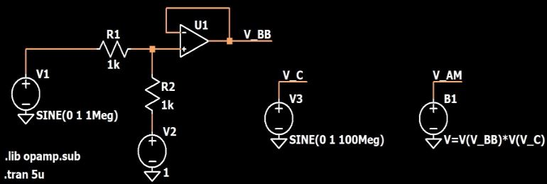

* V1是提供原始基带信号的1 MHz正弦波电压源。
* V3为载波产生一个100 MHz的正弦波。
* 运算放大器电路是一个电平转换器（它还将输入幅度降低了一半）。来自V1的信号是一个从–1 V摆动到+1 V的正弦波，而运算放大器的输出是一个从0 V摆动到+1 V的正弦波。
* B1是“任意行为电压源”。它的“值”字段是公式，而不是常量。在这种情况下，公式为偏移的基带信号乘以载波波形。这样，B1可用于执行幅度调制。

这是偏移的基带信号：

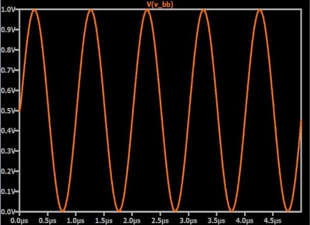

在这里，您可以看到AM变化如何与基带信号相对应（即大部分被蓝色波形遮盖的橙色迹线）

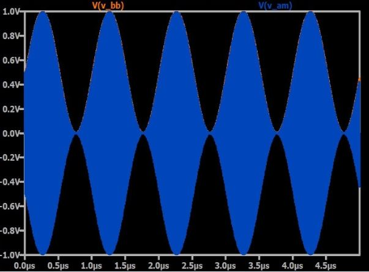

放大显示100 MHz载波频率的各个周期。

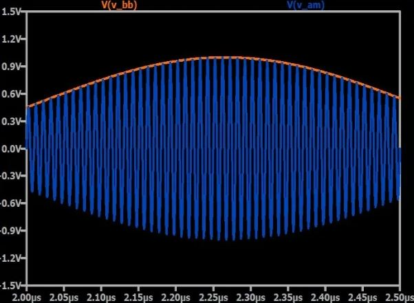

### 解调

如AM调制页面中所述，用于执行幅度调制的乘法运算具有将基带频谱传输到正载波频率（+ fC）和负载波频率（–fC）周围的频带的效果。因此，我们可以将幅度调制视为将原始频谱向上移动fC并向下移动fC。随之而来的是，将调制信号乘以载波频率会将频谱传输回其原始位置，即，它将频谱向下移动fC，使其再次以0 Hz为中心。

#### 选项1：乘法和滤波
下面的LTspice原理图包括解调任意行为电压源。 B2将AM信号乘以载波。

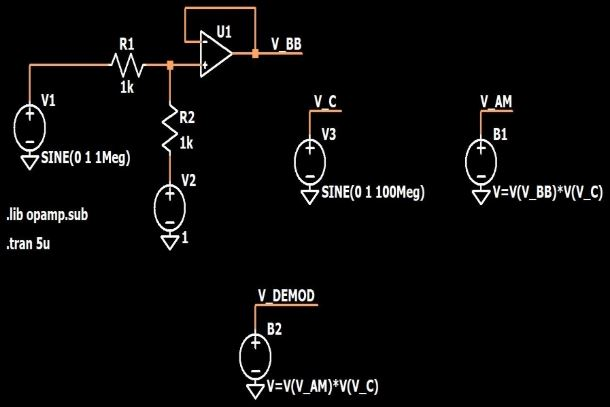

结果如下：

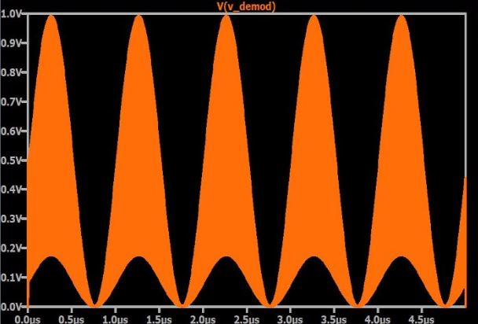

这肯定看起来不正确。如果放大，则会看到以下内容：

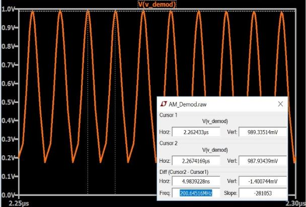

这揭示了问题所在。经过幅度调制后，基带频谱以+ fC为中心。将AM波形乘以载波可将基带频谱下移至0 Hz，但也会将其上移至2fC（在这种情况下为200 MHz），因为（如上所述）乘法将现有频谱上移fC并下移fC 。显然，仅乘法是不足以进行适当解调的，我们需要的是乘法和低通滤波器。滤波器可抑制移至2fC的频谱。以下原理图包括一个截止频率约为1.5 MHz的RC低通滤波器。

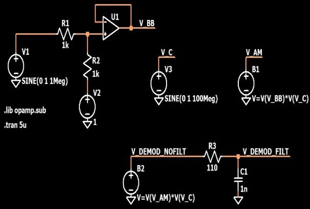

以下是解调信号：

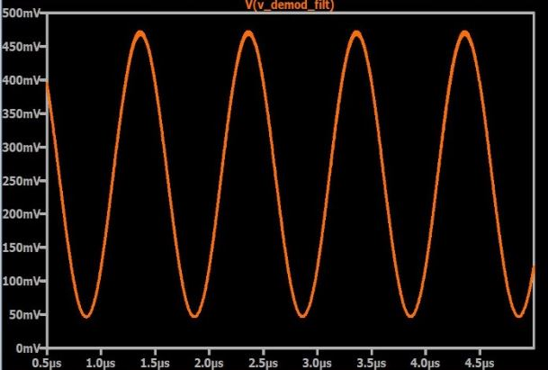

这种技术实际上比看起来要复杂得多，因为接收器的载波频率波形的相位必须与发射器的载波的相位同步。本章第5页（了解正交解调）将对此进行进一步讨论。

#### 选项2：峰值检测器
如上图所示，图中显示了AM波形（蓝色）和偏移的基带波形（橙色），AM“包络”的正部分与基带信号匹配。术语“包络”是指载波的正弦振幅变化（与波形本身的瞬时值变化相反）。如果我们能够以某种方式提取AM包络的正部分，则可以在不使用乘法器的情况下再现基带信号。

事实证明，将正包络转换为正常信号非常容易。我们从一个峰值检测器开始，它只是一个二极管，后面是一个电容器。当输入信号至少比电容器上的电压高约〜0.7 V时，二极管导通，否则，其作用类似于开路。因此，电容器保持峰值电压：如果当前输入电压低于电容器电压，则电容器电压不会降低，因为反向偏置二极管会阻止放电。

但是，我们不希望峰值检测器能够长时间保持峰值电压。取而代之的是，我们需要一种电路，该电路保留相对于载波波形的高频变化的峰值，但不保留相对于包络的低频变化的峰值。换句话说，我们想要一个峰值检测器，它仅在短时间内保持峰值。我们通过添加允许电容器放电的并联电阻来实现。 （这种类型的电路称为“漏电峰值检测器”，其中“漏电”是指电阻器提供的放电路径。）选择的电阻应使放电足够慢以平滑载波频率，而要足够快以使载波频率平滑，但无法平滑包络频率。

这是用于AM解调的泄漏峰值检测器的示例：

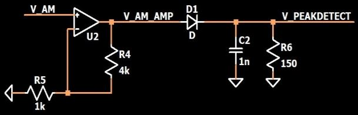

请注意，我已经将AM信号放大了五倍，以使峰值检测器的输入信号相对于二极管的正向电压更大。下图显示了我们试图通过泄漏峰值检测器获得的总体结果。

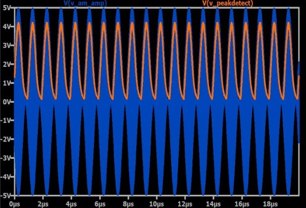

最终信号表现出预期的充电/放电特性：

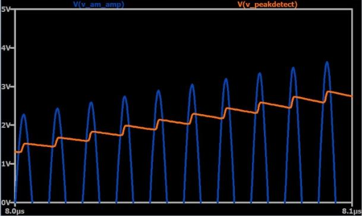

低通滤波器可用于消除这些变化。

### 总结
* 在LTspice中，可以使用任意行为电压源来创建AM波形。
* 可以使用乘法器和低通滤波器对AM波形进行解调。
* 一种更简单（且成本更低）的方法是使用泄漏峰值检测器，即具有并联电阻的峰值检测器，该峰值检测器允许电容器以适当的速率放电。