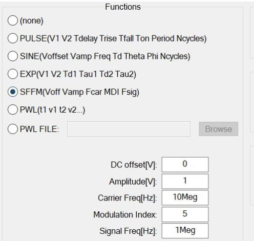
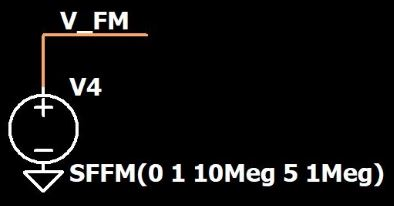
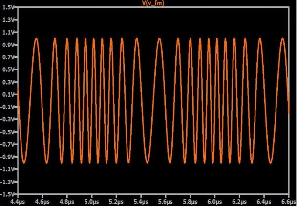
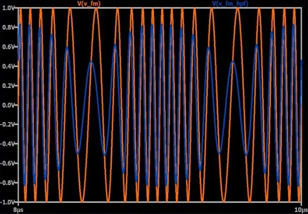
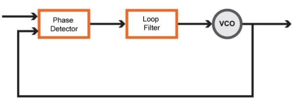

# 如何解调FM波形

------

## 第五章 射频解调

了解有关从调频载波恢复基带信号的两种技术。

调频可以提供比调幅更好的性能，但是要从FM波形中提取原始信息要困难一些。解调FM有几种不同的方法。在此页面中，我们将讨论两个。其中之一非常简单，而另一个则更为复杂。

### 创建信号

与如何解调AM波形一样，我们将使用LTspice探索FM解调，并且我们再次需要首先执行频率调制，以便进行解调。如果您回顾一下有关模拟频率调制的页面，您会发现其数学关系不如幅度调制简单。使用AM，我们只需添加一个偏移量，然后执行普通乘法。使用FM，我们需要将连续变化的值添加到正弦（或余弦）函数内部的数量上，此外，这些连续变化的值不是基带信号，而是基带信号的积分。

因此，我们无法像使用AM那样使用任意的行为电压源和简单的数学关系来生成FM波形。但事实证明，实际上更容易产生FM信号。我们仅将SFFM选项用于普通电压源：

下面的“电路”是创建由10 MHz载波和1 MHz正弦基带信号组成的FM波形所需的全部工作：

注意，调制指数是5；调制指数是5。较高的调制指数使查看频率变化更加容易。下图显示了SFFM电压源创建的波形。

### 解调：高通滤波器

我们将要研究的第一种解调技术是从高通滤波器开始的。我们假设我们正在处理窄带FM（在此页面中简要讨论）。我们需要设计高通滤波器，以使衰减在一个宽度是基带信号带宽两倍的频带内发生明显变化。让我们更深入地探讨这个概念。收到的FM信号将具有一个以载波频率为中心的频谱。频谱的宽度大约等于基带信号带宽的两倍；正负两个基带频率的偏移产生了两个因数（如此处所述），并且之所以“近似”相等，是因为应用于基带信号的积分会影响调制频谱的形状。因此，调制信号中的最低频率大约等于载波频率减去基带信号中的最高频率，而调制信号中的最高频率大约等于载波频率加基带信号中的最高频率。我们的高通滤波器需要具有一个频率响应，从而使调制信号中的最低频率衰减得比调制信号中的最高频率大得多。如果将此滤波器应用于FM波形，将得到什么结果？将会是这样的：

为了进行比较，该图同时显示了原始FM波形和高通滤波波形。下图仅显示滤波后的波形，因此您可以更清楚地看到它。

通过应用滤波器，我们已将频率调制转换为幅度调制。这是一种方便的FM解调方法，因为它使我们能够受益于已开发用于幅度调制的包络检波器电路。用于产生该波形的滤波器不过是具有截止频率近似等于载波频率的RC高通。

### 振幅噪声

这种解调方案的简单性自然使我们认为它不是性能最高的选择，实际上，这种方法确实存在一个主要缺点：它对幅度变化敏感。发射信号将具有恒定的包络，因为频率调制不涉及载波幅度的变化，但是接收信号将不具有恒定的包络，因为幅度不可避免地受到误差源的影响。因此，我们不能仅通过向AM解调器添加高通滤波器来设计可接受的FM解调器。我们还需要一个限幅器，它是一种通过将接收信号限制为一定幅度来减轻幅度变化的电路。这种简单有效的幅度变化补救措施的存在使FM能够保持其对幅度噪声的更大（与AM相比）的鲁棒性：我们不能对AM信号使用限制器，因为限制幅度会破坏载波中编码的信息。另一方面，FM将所有信息编码为发射信号的时间特性。

### 解调：锁相环

锁相环（PLL）可用于创建复杂但高性能的FM解调电路。 PLL可以“锁定”输入波形的频率。它通过将相位检测器，低通滤波器（也称为“环路滤波器”）和压控振荡器（VCO）组合到负反馈系统中来实现此目的，如下所示：

PLL锁定后，它可以创建一个输出正弦波，其跟随输入正弦波的频率变化。该输出波形将从VCO的输出中获取。但是，在FM解调器应用中，我们不需要与输入信号具有相同频率的输出正弦波。相反，我们将环路滤波器的输出用作解调信号。

鉴相器产生与输入波形和VCO输出之间的相位差成比例的信号。环路滤波器对该信号进行平滑处理，然后将其变为VCO的控制信号。因此，如果输入信号的频率不断增加和减少，则VCO控制信号必须相应地增加和减少，以确保VCO输出频率保持等于输入频率。换句话说，环路滤波器的输出是其幅度变化对应于输入频率变化的信号。 PLL就是这样完成频率解调的。

### 总结
* 在LTspice中，可以通过将SFFM选项用于标准电压源来生成调频正弦波。
* 一种简单有效的FM解调技术涉及一个高通滤波器（用于FM到AM的转换），然后是AM解调器。
* 在基于高通滤波器的FM解调器之前装有限幅器，以防止幅度变化对解调信号造成误差。
* 锁相环可用于实现高性能FM解调。集成电路PLL的使用使这种方法看起来不那么复杂。