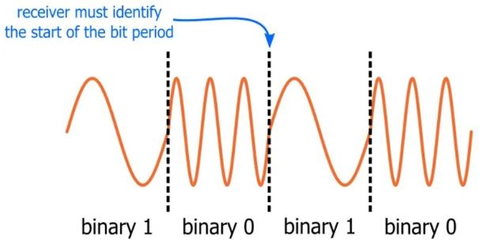
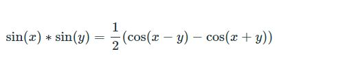
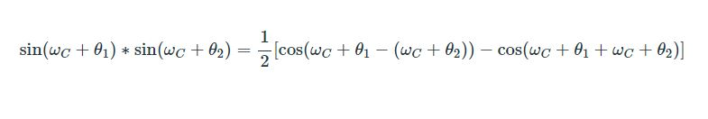
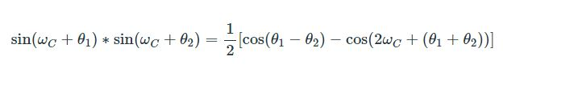
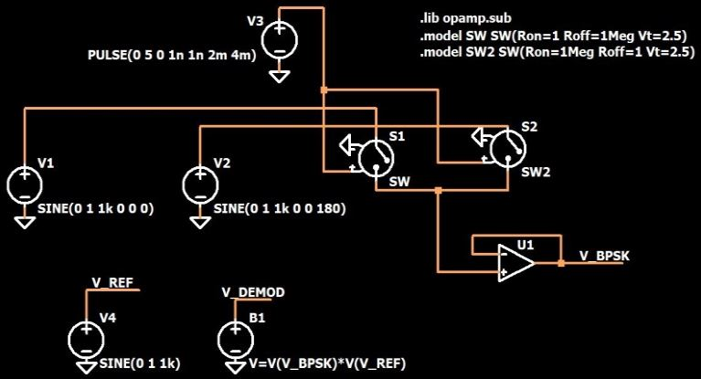
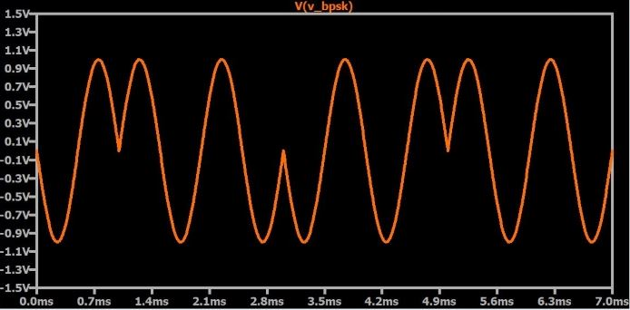
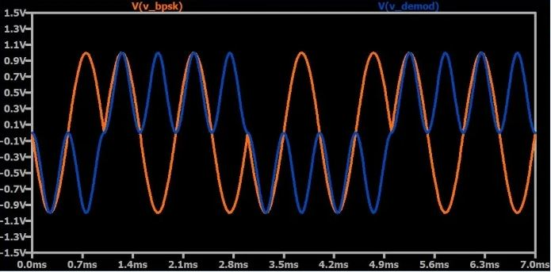
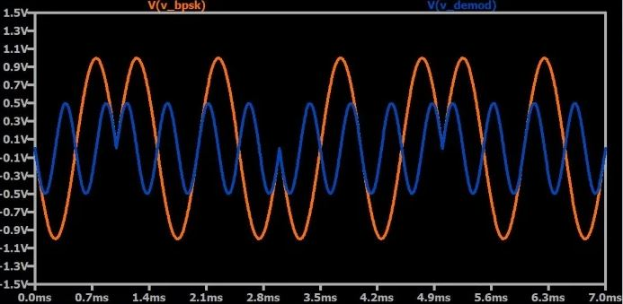

# 如何解调数字调相

------

## 第五章 射频解调

了解有关如何从相移键控波形中提取原始数字数据的信息。

在前两节中，我们讨论了用于解调AM和FM信号的系统，这些信号承载模拟数据，例如（非数字化）音频。现在我们准备看一下如何恢复通过第三种通用调制方式（即相位调制）编码的原始信息。

但是，模拟相位调制并不常见，而数字相位调制则非常常见。因此，在数字RF通信的背景下探索PM解调更为有意义。我们将使用二进制相移键控（BPSK）探索该主题。不过，请注意，正交相移键控（QPSK）与现代无线系统更为相关。

顾名思义，二进制相移键控通过将一个相位分配给二进制0并将一个不同的相位分配给二进制1来表示数字数据。两个相位相隔180°以优化解调精度-两个相位值之间的间隔越大，越容易解码符号。

### 乘法和集成---同步

BPSK解调器主要由两个功能块组成：一个乘法器和一个积分器。这两个分量将产生与原始二进制数据相对应的信号。但是，还需要同步电路，因为接收器必须能够识别比特周期之间的边界。这是模拟解调和数字解调之间的重要区别，下面让我们仔细看看。

*该图展示了频移键控信号，相同的概念同样适用于数字相位调制和数字幅度调制。*

在模拟解调中，信号实际上没有开始或结束。想象一下正在广播音频信号的调频发射机，即根据音乐不断变化的信号。现在想象一下最初关闭的FM接收器。用户可以在任何时候为接收器供电，解调电路将开始从调制载波中提取音频信号。提取的信号可以被放大并发送到扬声器，音乐将听起来很正常。接收者不知道音频信号是否代表一首歌曲的开头或结尾，或者解调电路是否在小节的开头，节拍上或两个节拍之间开始起作用。没关系每个瞬时电压值对应于音频信号中的一个确切时刻，并且当所有这些瞬时值都连续出现时，将重新创建声音。

使用数字调制时，情况完全不同。我们不是在处理瞬时振幅，而是处理代表一个离散信息（即一个数字（1或0））的一系列振幅。每个幅度序列（称为符号，持续时间等于一个比特周期）必须与之前和之后的序列区分开：如果广播公司（来自上述示例）正在使用数字调制，并且接收机上电并开始在以下位置进行解调一个随机的时间点，会发生什么？好吧，如果接收器恰好在一个符号的中间开始解调，它将试图解释一个符号的一半和下一个符号的一半。当然，这会导致错误；逻辑一符号后跟逻辑零符号将有相等的机会被解释为1或0。

显然，在任何数字RF系统中，同步都必须有高优先级。一种简单的同步方法是在每个数据包之前添加预定义的“训练序列”，该序列由交替的零符号和一个符号组成（如上图所示）。接收器可以使用这些0010的跳变来识别符号之间的时间边界，然后可以简单地通过应用系统的预定义符号持续时间正确地解释数据包中的其余符号。

### 乘法的影响

如上所述，PSK解调的基本步骤是乘法。更具体地说，我们将输入的BPSK信号乘以参考信号，该参考信号的频率等于载波频率。这有什么作用？让我们通过数学方式看一下；首先，产品确定两个正弦函数：

如果将这些通用正弦函数转换为具有频率和相位的信号，我们将具有以下特征：

简化如下：

因此，当我们将两个频率相等但相位不同的正弦波相乘时，结果是频率增加一倍的正弦波加上一个取决于两个相位之差的偏移量。偏移是关键：如果接收信号的相位等于参考信号的相位，我们的cos（0°）等于1。如果接收信号的相位与相位的相位差180°，参考信号，我们有cos（180°），即–1。因此，乘法器的输出对于一个二进制值将具有正DC偏移，而对于另一个二进制值将具有负DC偏移。此偏移量可用于将每个符号解释为零或一。

### 仿真

以下BPSK调制和解调电路向您展示了如何在LTspice中创建BPSK信号：

两个正弦波源（一个相位为0°，一个相位为180°）连接到两个电压控制开关。两个开关具有相同的方波控制信号，并且通断电阻被配置为一个断开，而另一个闭合。两个开关的“输出”端子连接在一起，运算放大器缓冲结果信号，如下所示：

接下来，我们得到一个参考正弦波（V4），其频率等于BPSK波形的频率，然后我们使用任意行为电压源将BPSK信号乘以参考信号。结果如下：

如您所见，解调后的信号是接收信号频率的两倍，并且根据每个符号的相位具有正负DC偏移。如果我们随后针对每个位周期对该信号进行积分，则将获得一个与原始数据相对应的数字信号。

### 相干检测

在此示例中，接收器参考信号的相位与输入调制信号的相位同步。这很容易在仿真中完成；在现实生活中要困难得多。此外，如本节“差分编码”中所讨论的，普通相移键控不能用于受发射器和接收器之间不可预测的相位差影响的系统。例如，如果接收机的参考信号与发射机的载波异相90°，则参考信号与BPSK信号之间的相位差将始终为90°，而cos（90°）为0。因此，DC偏移为丢失，系统完全无法运行。

可以通过将V4源的相位更改为90°来确认。结果如下：

### 总结

* 数字解调需要位周期同步；接收机必须能够识别相邻符号之间的边界。
* 二进制相移键控信号可以通过乘法然后积分进行解调。乘法步骤中使用的参考信号与发射机的载波具有相同的频率。
* 仅当接收器参考信号的相位可以与发送器载波的相位保持同步时，普通相移键控才是可靠的。